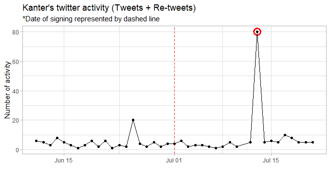
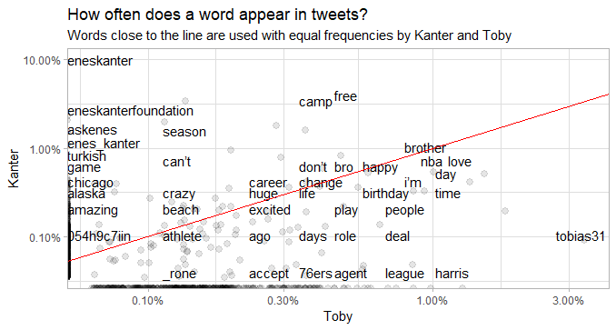
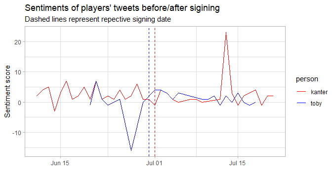

If you're an NBA fan like me, there's a good chance you found yourself F5'ing on reddit all summer long for breaking news. While doing so, you probably ran across a couple of ridiculous non-basketball related posts, and I'm here to contribute to just that. It's been pretty crazy this offseason and lots of players changed teams to either get paid or have a shot at the title. (RIP DeMarcus) That led me to think: "do players actually care as much as we do about the changes in their professional lives?" So I decided to do a sentiment analysis of NBA players 3 weeks before/after signing a deal. 

In this post, I broke down the twitter accounts of [Enes Kanter](https://twitter.com/EnesKanter) and [Tobias Harris](https://twitter.com/tobias31
). They are very active on Twitter with completely different personalities, and Kanter went to a new team, while Toby re-signed with the Sixers, which makes them perfect candidates for this analysis. Without further ado, let's get into this.

## Twitter Activity

One thing I'll say before anything: Kanter tweets A LOT. In the 6-week period, he tweeted about 250 tweets, while Toby only had about 80. To match Kanter's enthusiasm, I also included Toby's favourited tweets for the analysis.

```{r echo = FALSE}

```

Do you see that ya boy Enes tweeted over 80 times on July 13th? That was when [he](https://twitter.com/robertlabbe0/status/1149877068374708225) was [having](https://twitter.com/robertlabbe0/status/1149877068374708225) a [good](https://twitter.com/BCaivana7/status/1149827147181301760) time [poking](https://twitter.com/DuragLuke/status/1149863469975576577) fun at [Kyrie's](https://twitter.com/dr_steph_dpt/status/1149896865724403712) #11 [jersey](https://twitter.com/ShortGannon/status/1149867649708376066), which happens to be his new number for the Celtics.

```{r echo = FALSE}
knitr::include_graphics("toby_activity.png")
```

Meanwhile, Toby was a little more reserved. (notice the max y-label tick at only 20) The very first peak was when [his brother got signed to the Sixers' summer league squad](https://twitter.com/PompeyOnSixers/status/1142111695365713920). The third peak is attributed to the end of an era: ["Toby & Bobi"](https://t.co/ETkAogwyO0). And only after 2 weeks of his new $180 million contract, he started [re-tweeting about it on July 17](https://t.co/NdmQHIwG3o). As you can see, his tweeting activities suggest he is a nice humble person who likes to put others before him.

## Frequency of words

Now that we have a decent idea of both player's personalities, let's compare their use of words in their tweets.

```{r echo = FALSE}

```

We see a lot of words that lie directly on either axes, meaning the other player did not use that word at all. (i.e. eneskanter, turkish, 76ers, harris tobias) But, generally speaking, I didn't find anything too interesting, other than the fact the Enes kanter's use of the word "tobias31" is not 0, meaning he has tweeted at him at least [once](https://t.co/NDrt2K2caB) this offseason.

## Sentiment timeline

If you're still reading this, the last thing I'll do is to look at change in sentiments during this time period. I used a sentiment dictionary to classify every word either positive or negative and tallied up the score for every passing day. Feel free to check out my [github](https://github.com/jiwanheo/kanter_toby_twitter) for more detail.

```{r echo = FALSE}

```

Can you notice the familiar spike in Kanter's sentiment? It's the day he trolled Kyrie lol guy must have been ecstatic. On the other hand, Toby must have been down on himself a few days before his contract renewal, right? Not so much. The negative sentiment here is driven by rhetorical motivation quotes like [... "Impossible is temporary, impossible is NOTHING."](https://t.co/oS2TRJYqDR). So if anything, his sentiment score should have been higher than usual.

## Conclusion

So what did I learn? 

1. Kanter is a huge troll.
2. Toby doesn't talk about his success all that much.
3. Nonetheless, measured by their recent twitter activities, both players were indifferent about their new situations.

Thank you for reading my first blog post! I hope you found this interesting. Most of my analytical methods came from [this excellent book by Julia Silge and David Robinson](https://www.tidytextmining.com/). 

