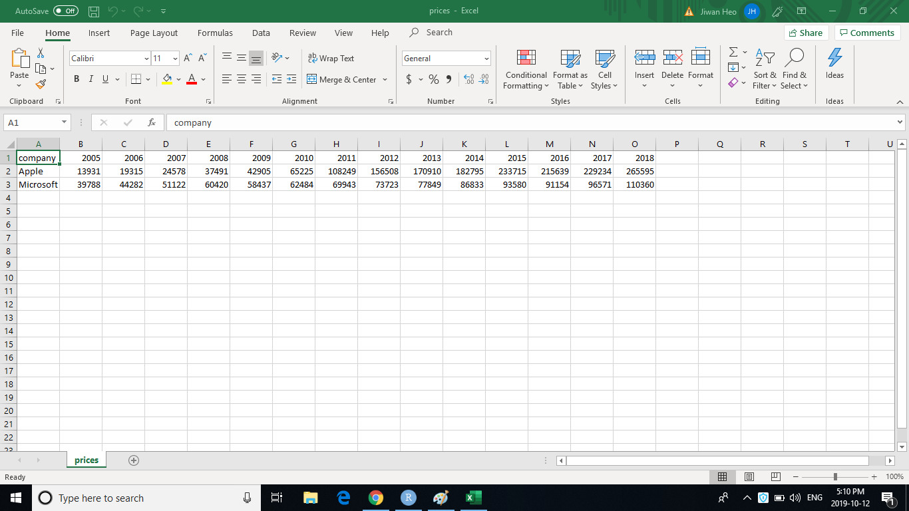

<style>
p.caption {
  font-size: 0.75em;
  font-style: italic;
  color: black;
  background-color: #f2f2f2;
}
</style>

Hey, this short post is going to go over how to better format your excel sheets for data analytics purposes. If you've ever worked with Excel in your professional/personal life, you've most likely ran into a budget sheet that looks like this.

```{r fig.cap = "Shoutout to dahkai.com, you insecure website", echo = FALSE}
knitr::include_graphics("example.png")
```

There's nothing too wrong about sheets like this when the file is relatively small, and you're just working within Excel. But even then, there are probably a bunch of consolidated cells, and hidden rows/columns that makes it hard for you to keep track of the formulas. Oh, and God forbid if someone else made that sheet, and you have to figure out how they constructed it. I personally find this really frustrating about Excel, and often choose to not use it at all. Today, I'm just gonna share with y'all quickly how I like to format my data.

```{r fig.cap = "Annual revenues have their own individual columns", echo = FALSE}

```

Above is the annual revenues of Apple and Microsoft between 2005 and 2018. You'll notice that the progression of time is represented horizontally. If I import this into R, I get a data.frame like this:

```{r message = FALSE}
library(tidyverse)

company_revenues <- read_csv("prices.csv")
company_revenues
```

This format is a little difficult to work with, because the unspoken agreement of most programming languages is that rows represent each instance of an object, and columns represent the characteristics about the objects. But what we have here is one characteristics (revenue) spanned over 14 columns. 

To remedy this, let's put the years in one column, and another column that represents the revenue for that year. In other words, I'm going to transpose the data. Firstly, I'm going to `gather` the data, which grabs the names of each column as `key` and what's inside that column as `value`. I chose to use the words key and value, but you can use any other words that make the most sense to you.

```{r}
company_revenues %>% 
  gather(key, value)
```

You get the idea, there were two elements in a single column, and they are basically organized into the format of column name, and corresponding column value. A neat trick: if you exclude a column from `gather`, the data will collect around them. What do I mean by this? Let's exclude company.

```{r}
company_revenues %>% 
  gather(key, value, -company)
```

Now, you'll see that there are year column and revenue column for both companies! This is great, because you can easily filter between the two companies to make some graphs. (I did so with facet_wrap(~ company))

```{r}
# A simplistic built-in theme 
theme_set(theme_light())

company_revenues %>% 
  gather(key, value, -company) %>% 
  ggplot(aes(key, value)) +
  geom_col() +
  scale_y_continuous(labels = scales::comma_format()) +
  facet_wrap(~ company) +
  labs(title = "Annual revenues of Apple and Microsoft",
       x = "Time",
       y = "Revenue in millions")
```


If you'd like, you can actually give each company a column of their own. In other words, we can `spread` the revenues by company.

```{r}
company_revenues %>% 
  gather(key, value, -company) %>% 
  spread(company, value)
```

So now, we have 14 rows for 14 instances of revenues of both companies. This is much easier to work with to make a graph for one company.

```{r}
company_revenues %>% 
  gather(key, value, -company) %>% 
  spread(company, value) %>% 
  ggplot(aes(key, Apple)) +
  geom_col() +
  scale_y_continuous(labels = scales::comma_format()) +
  labs(title = "Apple revenue over the years",
       x = "Time",
       y = "Revenue in millions")
```

Hope you got something out of this. See you next time :)