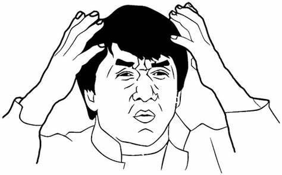
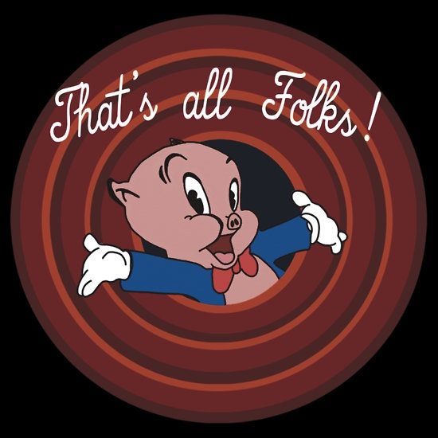

I was in a meeting this week with a software company, and came across a machine learning technique that I wasn't too familiar with, _ARIMA_. Instinctively, I wanted to look it up and make a short post about it with an easy example. But it turns out that there was a lot of stuff that I needed to know before even approaching this concept. I despise long posts explaining things, so, I think it's best to split up this whole ARIMA thing into small chunks.

```{r fig.cap = "What is ARIMA????", echo = FALSE}

```

ARIMA stands for "AutoRegressive Integrated Moving Average". What does that even mean in English? It's basically a technique used to determine future value of something in a time-series. Think of stock prices or number of passengers in an airline company. 

But hey! Let's not get too ahead of ourselves. We first need to know a thing or two about time serieses. (Matty's probably triggered by that word if he's reading this) A time series needs to be _stationary_ for us to even do any sort of analysis. I'm gonna just focus on explaining this today.  

## Stationarity

Stationarity is just a fancy word for saying that data must have: 

__1. Constant mean over time__ (or average, if you prefer)

```{r}
par(mfrow=c(1,2))

x <- seq(0,8*pi,length.out=100)
y <- sin(x)
constant <- plot(x, y, type="l",
                 main = "Graph 1", xlab = "Time", ylab = "")
not_constant <- plot(x, y+x, type = "l",
                     main = "Graph 2", xlab = "Time", ylab = "")
```

See how the first graph (sine wave) is centered around the mean of 0, and the second one doesn't really have a common mean. No matter which intervals you pick from the first graph, the mean will be 0, but you can't say the same with the second graph, as it depends on which interval you pick along the x-axis.

__2. Constant variance over time__ (how much the data fluctuates)

This one's pretty easy. Variance essentially means what is the difference between the peak and the trough of a period, or high and low. You want this to be consistent, whichever time period you pick.

```{r}
par(mfrow=c(1,2))

x <- seq(0,8*pi,length.out=100)
y <- sin(x)
t <- seq(0:4)
y_ <- t/x * sin(x * t) 
constant <- plot(x, y, type="l",
                 main = "Graph 1", xlab = "Time", ylab = "")
not_constant <- plot(x, y_, type = "l",
                     main = "Graph 2", xlab = "Time", ylab = "")
```

The first graph shows a constant variance whereever you look at, but you can't say the same with the second graph. Period between 0 & 3 is way larger than 10 & 13.

__3. Covariance of two values that is independent of time__ 

Covariance is just how one variable moves with another variable. Using a stock example, it is how price at _t_ moves in relation to price at _t-1_. If they are independent of time, the change should be the same where ever you look at. 

```{r}
par(mfrow=c(1,2))

x <- seq(0,8*pi,length.out=100)
f <- x/pi
y <- sin(x)
y_ <- sin(2*pi*f*x)

constant <- plot(x, y, type="l",
                 main = "Graph 1", xlab = "Time", ylab = "")

not_constant <- plot(x, y_, type = "l",
                     main = "Graph 2", xlab = "Time", ylab = "")
```

You'll notice in the second graph (don't ask me what it is, I just played around with the stuff I found on stackoverflow :sweat_smile:),  that the density of the waves are irregular, depending on where you look in the x-axis. This is what happens when the covariance of two variables (or price of a stock at _t_ and _t-1_) is dependent on time. The interval between 5 & 10 is very different from that of 20 & 25 in the second graph, whereas it doesn't change at all in the first graph.

```{r fig.cap = "BYE", echo = FALSE}

```

There you have it y'all, that wasn't so bad eh? Now that we covered the necessary requirements of a time series analysis, we'll look at some other interesting things.