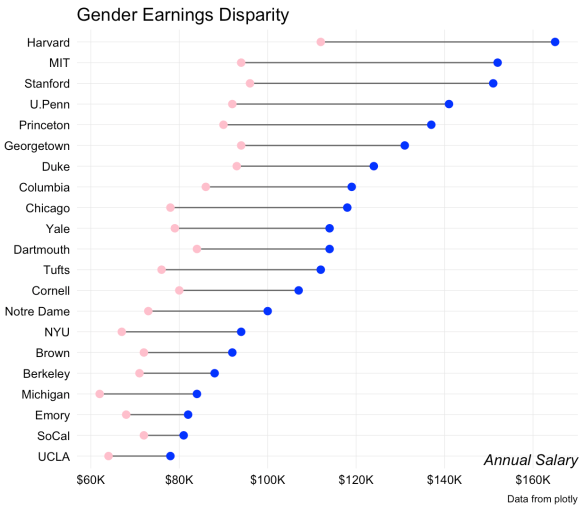

Hey! Since my last post a long time ago, I finally wrapped up my undergrad, so have a little more free time in weekends. Even though I haven't worked on this blog for a while, I haven't been completely lazy with reading! Lately, I've been reading about infographics. It's interesting because some of them are written by journalists, with the focus of storytelling. They emphasize the need to balance the aesthetics and functionality of your graphs. 

Among many things I came across while reading these books, what really caught my attention is the "Lollipop chart". 

```{r echo = FALSE, message = FALSE, warning = FALSE, caption = "Lollipop chart example"}

```

Also known as the barbell charts, these types of graphs are effective in showing changes between two points. In the example above, we can easily compare the earnings of both genders. (I would have represented the genders by icons, rather than colors, but that's besides the point)  

In this post, I'm going to show how we can leverage the simplicity of lollipop chart to __compare__ housing price changes.

## Let's do some data processing!

```{r message = FALSE, warning = FALSE}
library(tidyverse)
```

The `ggplot` package comes with a dataset `txhousing`, which has housing prices of Texas over time.

```{r}
txhousing %>% head()
```

Now, traditionally, the most common way to visualize the changes in housing prices is to show a graph like this:

```{r warning = FALSE, caption = "Same old line graph"}
theme_set(theme_light())

txhousing %>% 
  ggplot(aes(date, median, color = city)) +
  geom_line() +
  scale_y_continuous(labels = scales::dollar_format()) +
  theme(legend.position = "none") +
  labs(title = "How did housing prices of Texas change over the years?",
       x = "Year",
       y = "Median price")
```

It's not bad, I can see that there has generally been an upwards movement. But it's almost impossible to single out a city like this, even with the colors, nor would it be efficient to label every single one of them. One way to solve this is to use `plotly` to make the graph interactive.

```{r warning = FALSE, message = FALSE}
library(plotly)

tx <- highlight_key(txhousing, ~city)
plot_ly(tx, color = ~city) %>% 
  group_by(city) %>% 
  add_lines(x = ~date, y = ~median) %>% 
  layout(title = "How did housing prices of Texas change over the years?",
         subtitle = "Double-click me!",
         xaxis = list(title = "Year"),
         yaxis = list(title = "Median price"))

```

`highligh_key` declares `city` variable as a "look up" value. What this means is you can look up a city in the whole dataset, which effectively isolates the chosen city. (Awkward wording, I know) Try double clicking a line, all other lines will be less visible now, but the chosen line maintains its brightness. This is essentially what's happening when you isolate a city. 

This is awesome, but there's still a lot of noise in the graph that I don't really need. What if I just used the lines of best fit instead?
```{r warning = FALSE, caption = "Little better?"}
txhousing %>% 
  ggplot(aes(date, median, color = city)) +
  geom_smooth(method = "lm") +
  scale_y_continuous(labels = scales::dollar_format()) +
  theme(legend.position = "none") +
  labs(title = "How did housing prices of Texas change over the years?",
       x = "Year",
       y = "Median price")
```

The `method = "lm"` argument in geom_smooth stands for linear model, and the grey are represents confidence interval, if you remember from STAT courses with Wayne. 

This graph isn't bad either. There's a significant reduction in noise, or complexity that we have to decipher. We only have to read the slopes of the lines to conclude the general increase in housing prices. 

But let's use the lollipop and see what happens.

First we need to prep the data. What I need is start and end prices of each city. I used the `data.table` package to group the dataset by city, and only pulled rows where the date is minimum and maximum.

```{r message = FALSE, warning = FALSE}
library(data.table)

tx_df <- as.data.table(txhousing)

start <- tx_df[tx_df[, .I[date == min(date)], by = city]$V1]
end <- tx_df[tx_df[, .I[date == max(date)], by = city]$V1]
```


Now we'll stack them and only select data we need

```{r}
stacked <- start %>% 
  rbind(end) %>% 
  select(city, median, date) %>% 
  arrange(city)
```

I wrote about the `spread` function in a [previous blog post](https://jiwanheo.rbind.io/blog/2019-10-12-improving-usability-of-budget-excel-sheets/). This gives me the ability to use values from both dates as separate columns. Additionally, we'll filter out the cities where we have missing data for start or end points.

```{r}
stacked <- stacked %>% 
  spread(date, median) %>% 
  rename(start = `2000`, end = `2015.5`) %>% 
  filter(!is.na(start) & !is.na(end))

stacked %>% 
  head()
```

See the `y` and `yend` argument below? This is why we went through the trouble of separating the starting point and end point into separate columns.

```{r}
stacked %>% 
  ggplot() +
  geom_segment(aes(x = city, xend = city, y = start, yend = end)) +
  geom_point(aes(city, start), color = "red", size = 4) +
  geom_point(aes(city, end), color = "green", size = 4)
```

This is messy isn't it? We can solve this by 
- arranging them by the average value of the start and end, and
- flipping the x and y axis

Also, I like adding a couple more things to spice up the graph
- two lines that represent average values of two time periods
- arrows going from start to end
- one pair of annotation to indicate what the start and end points are

```{r}
stacked <- stacked %>% 
  mutate(avg = (start + end)/2) %>% 
  mutate(city = fct_reorder(city, avg))
```

```{r}
stacked %>% 
  ggplot() +
  geom_segment(aes(x = city, xend = city, y = start, yend = end),
               arrow=arrow(type = "closed", length = unit(0.15, "inches"))) +
  geom_point(aes(city, start), color = "red", size = 4) +
  geom_point(aes(city, end), color = "green", size = 4) +
  geom_hline(yintercept = as.numeric(stacked %>% summarize(mean(start))), color = "red", linetype = "dashed") +
  geom_hline(yintercept = as.numeric(stacked %>% summarize(mean(end))), color = "green", linetype = "dashed") +
  geom_text(data = stacked %>% filter(city == "Irving"),
            aes(city, start, label = "Year 2000", hjust = 1.2)) +
  geom_text(data = stacked %>% filter(city == "Irving"),
            aes(city, end, label = "Year 2015", hjust = -0.2)) +
  scale_y_continuous(labels = scales::dollar_format()) +
  coord_flip() +
  labs(title = "How did housing prices of Texas change over the years?",
       x = "City",
       y = "Median price")
```

We can make this interactive by wrapping the whole thing in `ggplotly` call, which converts a ggplot object to a plotly object. However, it's not perfect, as some of the features we want are not converted. I haven't figured out how to get around it, but I should lol

```{r}
ggplotly(stacked %>% 
  ggplot() +
  geom_segment(aes(x = city, xend = city, y = start, yend = end),
               arrow=arrow(type = "closed", length = unit(0.15, "inches"))) +
  geom_point(aes(city, start), color = "red", size = 4) +
  geom_point(aes(city, end), color = "green", size = 4) +
  geom_hline(yintercept = as.numeric(stacked %>% summarize(mean(start))), color = "red", linetype = "dashed") +
  geom_hline(yintercept = as.numeric(stacked %>% summarize(mean(end))), color = "green", linetype = "dashed") +
  geom_text(data = stacked %>% filter(city == "Irving"),
            aes(city, start, label = "Year 2000", hjust = 0)) +
  geom_text(data = stacked %>% filter(city == "Irving"),
            aes(city, end, label = "Year 2015", hjust = 0)) +
  scale_y_continuous(labels = scales::dollar_format()) +
  coord_flip() +
  labs(title = "How did housing prices of Texas change over the years?",
       x = "City",
       y = "Median price"))
```

## Conclusion

So there you have it, we've seen different ways to compare data. Lollipop chart is useful when we're trying to just compare multiple things against each other, and the little details are not as important. In the txhousing example, we almost completely eliminated the `date` variable by reducing all dates into just two points.

Hopefully this was useful. See ya!