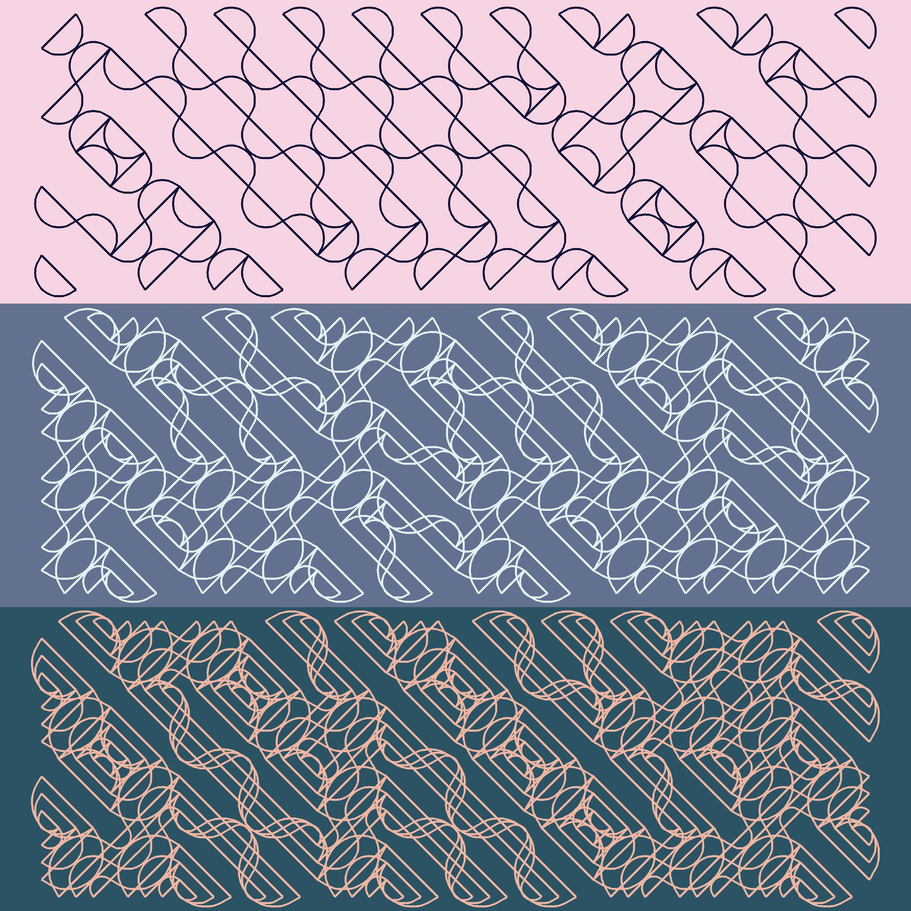
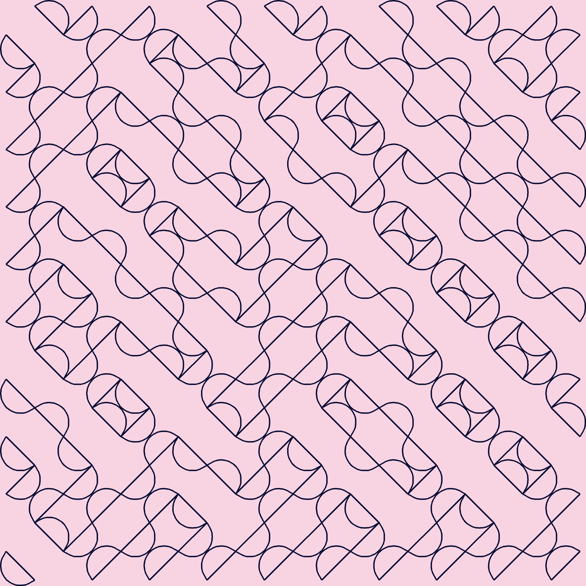
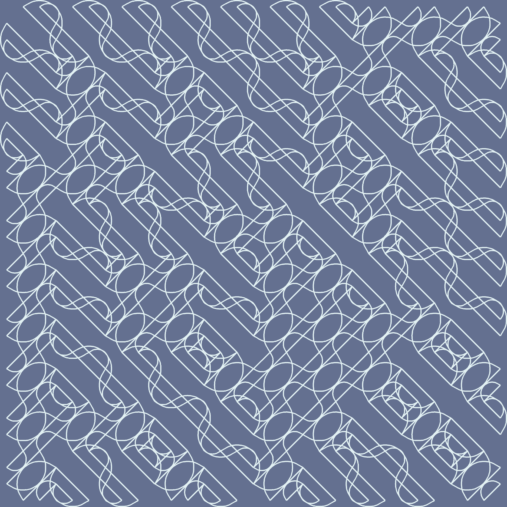
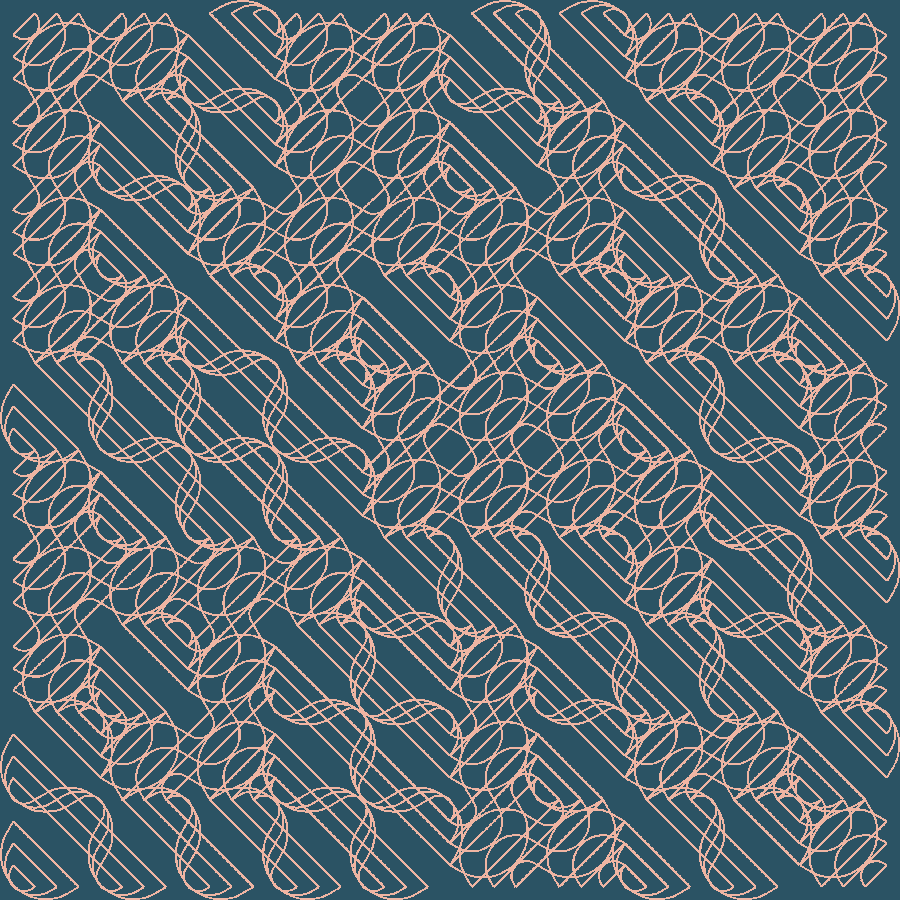

Hey there!

Hope you're having a fantastic day! It's long weekend here in Canada, and using the extra day off, I revisited and solved a problem that I was stuck in for a while. It was about the Truchet tiles.

```{r echo = FALSE}
blogdown::shortcode('tweet', '1394508535917170690')
```

After spending a lot more time than I'd like to admit, I eventually found the problem was in rounding differences when comparing whole numbers 💩💩💩 Which was kinda strange, but I got around it by increasing the rounding digits.

Nonetheless, this is what I came up with:
```{r echo = FALSE, out.width='50%', fig.align='center'}

```

Or, un-`patchwork`'d:

```{r echo = FALSE, out.width='50%', fig.align='center'}

```

```{r echo = FALSE, out.width='50%', fig.align='center'}

```

```{r echo = FALSE, out.width='50%', fig.align='center'}

```

I found many useful resources like [this](https://www.youtube.com/watch?v=2R7h76GoIJM&t=340s) or  [this](https://www.youtube.com/watch?v=4gdfs89hSxg), but never ran into a full-on R tutorial, so here we go 💪💪💪

The code is [here](https://github.com/jiwanheo/my-aRt/blob/master/truchet-tiles/draw_multi_line_truchet.R). The above plots were created with varying `nrow`, `ncol` & `num_div` values.

# Quick Intro on Truchet 

[Sébastien Truchet](https://en.wikipedia.org/wiki/S%C3%A9bastien_Truchet) was a French priest under the reign of Louis XIV.


Don't be fooled by his mischievous looks, because he has a really impressive resume! For starters, he invented a typographic system called _Romain du Roi_, which eventually became the _Times New Roman_ font of today. As a side hustle, he built most of the canals in France, and while doing so, spent his free time arranging tiles to make #Rtistry. And one day, he discovered an interesting pattern.

The Truchet pattern is made by covering a surface area using 4 square tiles. 


You can stack them with a scheme:


Or without:


If we take out the colours, and just draw the diagonal lines, we get a maze: 


(sorry, the shapes don't exactly line up, but you get the idea)

This type of maze is what I focused in this post, partly because I'm not good at polygons in ggplot lol 

Let's get into it!

# How to make the maze

```{r message = FALSE, warning = FALSE}
library(tidyverse)
theme_set(theme_light())
```

This is what we start with. A rectangular x/y and xend/yend of +1, to be able to draw diagonal lines with `geom_segment`.

```{r}
df <- crossing(x = 1:10, y = 1:10) %>% 
  mutate(xend = x+1,
         yend = y+1)

df
```

```{r}
df %>% 
  ggplot() +
  geom_point(aes(x, y)) +
  geom_segment(aes(x=x, y=y, xend=xend, yend=yend)) +
  coord_equal()
```

Now, we give all those lines a `flip` probability, and if below 0.5, flip the x & xend. 

Let's demonstrate this on the first row.

```{r}
df %>% 
  mutate(flip = map_dbl(y, ~ifelse(.x == 1, 0.2, 0.8))) %>% 
  mutate(x    = pmap_dbl(list(flip, x),    ~ifelse(.x<0.5, .y, .y+1)),
         xend = pmap_dbl(list(flip, xend), ~ifelse(.x<0.5, .y, .y-1))) %>% 
  ggplot() +
  geom_point(aes(x, y)) +
  geom_segment(aes(x = x, y = y, xend = xend, yend = yend)) +
  coord_equal()
```

If we mix it up, we get something interesting.

```{r}
df <- df %>% 
  mutate(flip = map_dbl(x, ~runif(n = 1, min = 0, max = 1))) %>% 
  mutate(x    = pmap_dbl(list(flip, x),    ~ifelse(.x<0.5, .y, .y+1)),
         xend = pmap_dbl(list(flip, xend), ~ifelse(.x<0.5, .y, .y-1))) 
```

```{r}
df %>% 
  ggplot() +
  geom_point(aes(x, y)) +
  geom_segment(aes(x=x, y=y, xend=xend, yend=yend)) +
  coord_equal()
```

There's our maze! You can play around with the flip chance, the degree of movement when flipped, or the size of the grid to make something more interesting.

That's the baseline Truchet pattern. Using what we just learend, things start to get a lot more interesting if we draw more than 1 line per tile, like so:

```{r echo = FALSE}
knitr::include_graphics("example1.png")
```

# How to make the multiline Truchet

>We'll put together a function, `draw_multi_line_truchet`, that takes the dimension of a grid, and number of lines in each tile, to draw a pattern.

First, we divide the width & height of a tile into n equal pieces. (i.e. above, width & height were divided into 4 equal parts, using 3 helper points)

This is called [linear interpolation](https://en.wikipedia.org/wiki/Linear_interpolation#:~:text=In%20mathematics%2C%20linear%20interpolation%20is,set%20of%20known%20data%20points.). Taking the 1st tile (bottom-left corner at x=1, y=1) as an example, the two sides to be interpolated are:

- width:   between (1,1) <-> (2,1) 
- height:  between (1,1) <-> (1,2)   


We start with the same setup as before (rectangular grid), and add the `lerp` function, which is short for linear interpolation. And a  `divide_square` function, which calls `lerp` twice on a given tile, to interpolate its x-axis and y-axis.

When calling `lerp` twice in `divide_square`, notice the slightly different x/y coordinates that represent the origin & destination points of linear interpolation. The output is a df of 2*`num_div` rows. Each row is a diagonal line inside a tile.

Then we repeat this for all of the tiles. `purrr::pmap_dfr` to the rescue!! I strategically lined up the argument order in `divide_square` to match the column names in df so I don't have to explicitly saying them lol (start_x in lerp <-> xloc in divide_square <-> x in df)

```{r}
draw_multi_line_truchet <- function(nrow, ncol = nrow, num_div){
  
  #setup
  df <- crossing(x = 1:ncol, y = 1:nrow) %>% 
    mutate(flip = map_dbl(x, ~runif(1,0,1))) #draw a number btw 0~1
  
  #interpolate a line
  lerp <- function(start_x, start_y, end_x, end_y, nlines, flip) {
    dat <- tibble(id = 1:(nlines+1)) %>%
      mutate(d = id / (nlines+1),
             x = (1-d)*start_x + d*end_x,
             y = (1-d)*start_y + d*end_y) %>% 
      filter(d != 1) %>%
      mutate(xend = x + (1-d),
             yend = y + (1-d))
    return(dat)
  }
  
  #call lerp twice, for x & y axis
  divide_square <- function(xloc, yloc, flip_chance, nlines = num_div) {
    bind_rows(
      lerp(xloc, yloc, xloc+1, yloc, nlines, flip_chance), # interpolate x axis
      lerp(xloc, yloc, xloc, yloc+1, nlines, flip_chance) # interpolate y axis
    ) 
  }
  
  #call lerp twice on all rows
  df <- df %>% 
    pmap_dfr(divide_square)
  
  return(df)
}
```

Let's use a 5x5 grid, and we want to interpolate a tile 3 times per side.
```{r}
test <- draw_multi_line_truchet(ncol = 5, nrow = 5, num_div = 3)

test
```

```{r}
test %>% 
  ggplot() +
  geom_point(aes(x = x, y = y)) +
  geom_segment(aes(x = x, y = y, xend = xend, yend = yend)) +
  coord_equal()
```

Awesome 💪 Explaining code is always tough, but hope you're following!

Now, I want to rotate a tile 90 degrees counter-clockwise randomly. The `lerp` function gets a little crazy.

Based on the value of "flip", we re-define the x, y, xend & yend coords of a segment. I also wanted to make sure the same lines of codes work as intended when `lerp`'ing x-axis and y-axis.

I ended up doing a ton of "Is this a y-axis transformation? Then do this calc. If not, do the other one". This is done 4 times, for the 4 coordinates at where I commented #3.

> If there were more dimensions/scenarios, I'd have a tough time scaling up

```{r}
draw_multi_line_truchet <- function(nrow, ncol = nrow, num_div){
  
  #1. setup (df is used to call everything in step #5)
  df <- crossing(x = 1:ncol, y = 1:nrow) %>% 
    mutate(flip = map_dbl(x, ~runif(1,0,1))) #draw a number btw 0~1
  
  lerp <- function(start_x, start_y, end_x, end_y, nlines, flip) {
    #2. interpolate a line
    dat <- tibble(id = 1:(nlines+1)) %>%
      mutate(d = id / (nlines+1),
             x = (1-d)*start_x + d*end_x,
             y = (1-d)*start_y + d*end_y) %>% 
      filter(d != 1) %>%
      mutate(xend = x + (1-d),
             yend = y + (1-d))
    
    #3. flip for fun
    if(flip<0.5) {
      dat <- dat %>% 
        mutate(
          #if true, it's the y axis (left) we're rotating to the x-axis (bottom) if not, bottom to right
          xnew    = imap_dbl(id, ~ifelse(dat[[.y, "x"]] == start_x, start_x + 1-dat[[.y, "d"]], start_x + 1)),
          ynew    = imap_dbl(id, ~ifelse(dat[[.y, "y"]] == start_y, start_y + dat[[.y, "d"]],   start_y)),
          # The strange comparison error. Got around by rounding up.
          xendnew = imap_dbl(
            id, ~ifelse(
              round(dat[[.y, "xend"]], digits = 2) != round(start_x+1, digits = 2),
              start_x,
              start_x + dat[[.y, "d"]]
            )
          ),
          yendnew = imap_dbl(
            id, ~ifelse(
              round(dat[[.y, "yend"]], digits = 2) == round(start_y+1, digits = 2),
              start_y + 1-dat[[.y, "d"]],
              start_y+1
            )
          )
        )
    }
    return(dat)
  }
  #4. call lerp twice, for x & y axis 
  divide_square <- function(xloc, yloc, flip_chance, nlines = num_div) {
    bind_rows(
      lerp(xloc, yloc, xloc+1, yloc, nlines, flip_chance), # interpolate x axis
      lerp(xloc, yloc, xloc, yloc+1, nlines, flip_chance) # interpolate y axis
    ) 
  }
  
  #5. call lerp twice on all rows (i guess this and #4 should technically be #1, 2, but yea)
  df <- df %>% 
    pmap_dfr(divide_square)
  
  return(df)
}
```

For example, when flipped, the new x position, `xnew` transformation, 
```{r eval = FALSE}
xnew = imap_dbl(id, ~ifelse(dat[[.y, "x"]] == start_x, start_x + 1-dat[[.y, "d"]], start_x + 1))
```

What I'm really doing is to iterate over an arbitrary column of our grid using `purrr:imap_dbl`, and using its index number to grab items in other columns from it

Let's break down that ifelse. 

__1. Condition__
```{r eval = FALSE}
dat[[.y, "x"]] == start_x
```

if the current row's x value is the same as `start_x`, (x of bottom left corner of a tile), this means the line that current row draws, starts from the left border, and ends at the bottom border. And the transformed line needs to start at the bottom border and end at the right border. 

__2. TRUE__

```{r eval = FALSE}
#true result 
start_x + 1-dat[[.y, "d"]]
```

We're rotating the left border to the bottom. From start_x, we add the distance between the current interpolated point, and the end point, on the y-axis (pre-flip).

__3. FALSE__

```{r eval = FALSE}
#false result
start_x + 1
```

We're rotating the bottom border to the right-side. They all have same x coords. Note that the point (1.25,1) gets rotated to (2,1.25)

To put it all together, the movement in the bottom row is what we're trying to achieve.

```{r echo = FALSE, warning = FALSE, message = FALSE}
draw_multi_line_truchet <- function(nrow, ncol = nrow, num_div){
  
  #setup
  df <- crossing(x = 1:ncol, y = 1:nrow) %>% 
    mutate(flip = map_dbl(y, ~ifelse(.x == 1, 0.2, 0.8))) #just the first row
  
  #interpolate a line
  lerp <- function(start_x, start_y, end_x, end_y, nlines, flip) {
    dat <- tibble(id = 1:(nlines+1)) %>%
      mutate(d = id / (nlines+1),
             x = (1-d)*start_x + d*end_x,
             y = (1-d)*start_y + d*end_y) %>% 
      filter(d != 1) %>%
      mutate(xend = x + (1-d),
             yend = y + (1-d))
    
    if(flip<0.5) {
      #Rounding was necessary to nail down the points for some reason
      
      dat <- dat %>% 
        mutate(
          #if true, it's the left axis we're rotating to bottom. if not, bottom to right
          xnew    = imap_dbl(id, ~ifelse(dat[[.y, "x"]] == start_x, start_x + 1-dat[[.y, "d"]], start_x + 1)),
          ynew    = imap_dbl(id, ~ifelse(dat[[.y, "y"]] == start_y, start_y + dat[[.y, "d"]],   start_y)),
          xendnew = imap_dbl(
            id, ~ifelse(
              round(dat[[.y, "xend"]], digits = 2) != round(start_x+1, digits = 2),
              start_x,
              start_x + dat[[.y, "d"]]
            )
          ),
          yendnew = imap_dbl(
            id, ~ifelse(
              round(dat[[.y, "yend"]], digits = 2) == round(start_y+1, digits = 2),
              start_y + 1-dat[[.y, "d"]],
              start_y+1
            )
          )
        )
    }
    return(dat)
  }
  #call lerp twice, for x & y axis
  divide_square <- function(xloc, yloc, flip_chance, nlines = num_div) {
    bind_rows(
      lerp(xloc, yloc, xloc+1, yloc, nlines, flip_chance), # interpolate x axis
      lerp(xloc, yloc, xloc, yloc+1, nlines, flip_chance) # interpolate y axis
    ) 
  }
  
  #call lerp twice on all rows
  df <- df %>% 
    pmap_dfr(divide_square)
  
  return(df)
}

test <- draw_multi_line_truchet(ncol = 5, nrow = 5, num_div = 3) 

test %>% 
  ggplot() +
  geom_point(aes(x = x, y = y)) +
  geom_segment(aes(x = x, y = y, xend = xend, yend = yend)) +
  geom_point(aes(x = xnew, y = ynew), color = "red") +
  geom_segment(aes(x = xnew, y = ynew, xend = xendnew, yend = yendnew), color = "red") +
  coord_equal()
```

Now, let `runif` decide which tiles to flip in the setup,

```{r}
draw_multi_line_truchet <- function(nrow, ncol = nrow, num_div){
  
  #setup
  df <- crossing(x = 1:ncol, y = 1:nrow) %>% 
    mutate(flip = map_dbl(x, ~runif(1,0,1))) #draw a number btw 0~1
  
  #interpolate a line
  lerp <- function(start_x, start_y, end_x, end_y, nlines, flip) {
    dat <- tibble(id = 1:(nlines+1)) %>%
      mutate(d = id / (nlines+1),
             x = (1-d)*start_x + d*end_x,
             y = (1-d)*start_y + d*end_y) %>% 
      filter(d != 1) %>%
      mutate(xend = x + (1-d),
             yend = y + (1-d))
    
    if(flip<0.5) {
      #Rounding was necessary to nail down the points for some reason
      
      dat <- dat %>% 
        mutate(
          #if true, it's the left axis we're rotating to bottom. if not, bottom to right
          x    = imap_dbl(id, ~ifelse(dat[[.y, "x"]] == start_x, start_x + 1-dat[[.y, "d"]], start_x + 1)),
          y    = imap_dbl(id, ~ifelse(dat[[.y, "y"]] == start_y, start_y + dat[[.y, "d"]],   start_y)),
          xend = imap_dbl(
            id, ~ifelse(
              round(dat[[.y, "xend"]], digits = 2) != round(start_x+1, digits = 2),
              start_x,
              start_x + dat[[.y, "d"]]
            )
          ),
          yend = imap_dbl(
            id, ~ifelse(
              round(dat[[.y, "yend"]], digits = 2) == round(start_y+1, digits = 2),
              start_y + 1-dat[[.y, "d"]],
              start_y+1
            )
          )
        )
    }
    return(dat)
  }
  #call lerp twice, for x & y axis
  divide_square <- function(xloc, yloc, flip_chance, nlines = num_div) {
    bind_rows(
      lerp(xloc, yloc, xloc+1, yloc, nlines, flip_chance), # interpolate x axis
      lerp(xloc, yloc, xloc, yloc+1, nlines, flip_chance) # interpolate y axis
    ) 
  }
  
  #call lerp twice on all rows
  df <- df %>% 
    pmap_dfr(divide_square)
  
  return(df)
}

test <- draw_multi_line_truchet(ncol = 5, nrow = 5, num_div = 3) 

test %>% 
  ggplot() +
  geom_point(aes(x = x, y = y)) +
  geom_segment(aes(x = x, y = y, xend = xend, yend = yend)) +
  coord_equal()
```

That's the core idea behind this neat pattern! 

After getting this down, I added some geom_curves, with alternating "curvature", with the exact same x, y, xend, yend. Finally, throw in some pretty colours, and Voilà! 

# After thoughts

Hope you learned something, this was a super fun challenge for me, and I really got to practice some `purrr` functions. We recently covered this package in our advanced R book club, so I'm very happy to find a use case!

I love plotting in R. It's still a little awkward to wrap my mind around, since I have to set up the complete dataframe, and then plot. But the good thing is that it's pushing my data wrangling skills, in areas that I didn't really know existed!

Not sure what I want to look into next. I can dig more into tiling (penrose looks interesting) or voronoi looks cool too. 

I should change the css of the code chunks to colour comments differently.