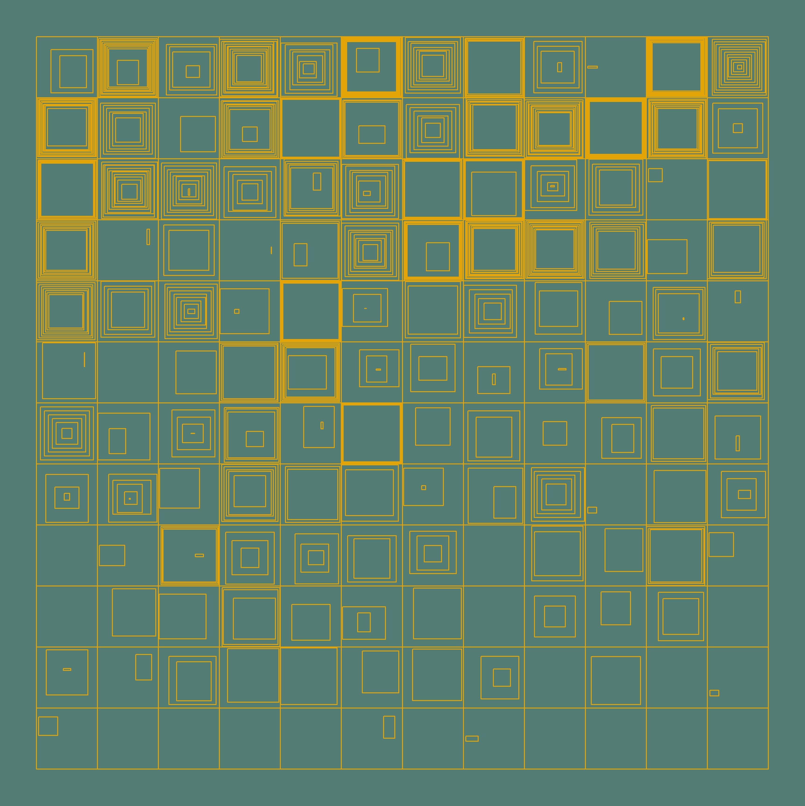

Heya, hope you're doing well! 

The other day, I read an interesting blog post from [generative artistry](https://generativeartistry.com/tutorials/hypnotic-squares/), which walks you through how to make this art piece: 

```{r echo = FALSE, out.width='50%', fig.align='center'}
knitr::include_graphics("https://generativeartistry.com/img/07-hypnotic-squares.png")
```
I love their work, because they do a really good job explaining what they were thinking at the time of building their art. It can be really challenging to precisely explain/document your thought processes (especially in a blog setting, you typically want to sequentially build up to the final result), so kudos to them!

While working on this, I was really surprised by the lack of history on this particular style of art! I feel like I've definitely seen this pattern before, but other than the blog above, which cited [William Kolomyjec](http://dada.compart-bremen.de/item/agent/644) as the creator, I wasn't able to gather too too much information. 

But yes. I just had to recreate this in ggplot! lol Let's gooooo 🔥🔥🔥🔥🔥🔥

I did my best to breathe some life into this stuff, and here's what I came up with at the end:

```{r echo = FALSE, out.width='50%', fig.align='center'}

```

Here's my code: https://github.com/jiwanheo/my-aRt/blob/master/hypnotic-squares/hypnotic-squares.R

And here's an attempt to explain my illegible code! 

# Core Idea

The core idea is pretty simple. 

- Define a grid 
- Draw some rectangles inwards, n times. (They never touch each other)
- Draw one final square (or not) of any size, that fits in the remaining space.
- Crowd all squares to a certain direction. It can cover any distance between its original position, and the 1 square before.

Right off the bat, you'll notice:

- There's less squares being drawn towards the bottom
- Some squares are "empty" in the middle
- The inner-most square has a lot more movement than the others. 

This is because:

- The number of squares drawn inwards is sampled from 1:y_position_of_the_square
- Only 1 square was drawn (the outer most square of a 1x1 square), or the inward squares had little space to work with before they stopped, leaving a big space in the middle
- The final square is drawn separately from the rest of the squares, and is not bound by the same scale as the second previous squares

# Dive in to the code

I still suck at explaining my codes, so it'll probably help if you have the source code open on the side, and referencing parts of this blog!

One thing I unfortunately couldn't get to work, was experienting with skew-normal distributions with the `sn` package. I wanted to introduce a different type of randomness, but unfortunately for now, it'll have to be uniform distribution. We'll get em next time 😭

There's three functions:

- `calc_hyp` creates the x/y data for a single iteration of a square
- `prepare_df` calls the above a bunch of times, to create a grid with unique squares (different params)
- `plot_n_save` is a util function to plot everything

The order I'm going to walk you through is:

1. Plot a single "tile" with inwards squares
2. Make a bunch of tiles
3. Spice it up a little


## 1. Plot a single "tile" with inwards squares

Let's start with 1 square. Here, I define a square with 2 pairs of min/max, and a seed for later.

```{r warning = FALSE, message = FALSE}
library(tidyverse) # i'd probably be homeless without yall folks 
```

```{r}
calc_hyp  <- function(start_x, start_y, my_seed = 9999) {
  set.seed(my_seed)
  
  df <- tibble(
    xmin = start_x,
    xmax = start_x + 1,
    ymin = start_y,
    ymax = start_y + 1
  ) %>% 
    mutate(id = row_number())
  df
}

calc_hyp(1, 1)
```

We can shuffle these around to define x/y coords of four vertices of a polygon. It's a little cheeky, but here's how I did it:

```{r}
format_df <- function(df) {
  df %>% select(
    id,
    x1 = xmax, x2 = xmin, x3 = xmin, x4 = xmax, 
    y1 = ymin, y2 = ymin, y3 = ymax, y4 = ymax  
  ) %>% 
    pivot_longer(cols = -id) %>%
    mutate(loc = str_extract(name, "^."))  %>%
    pivot_wider(id_cols = id, names_from = loc, values_from = value, values_fn = list) %>%
    unnest(cols = c(x, y))
}

one_square <- calc_hyp(1, 1) %>% format_df()
one_square
```

format_df is a quick function that formats our results into a geom_polygon format. It'll eventually live in the calc_hyp function.

```{r}
ggplot() +
  geom_polygon(data = one_square,
               aes(x = x, y = y, group = factor(id)),
               color = "#000000", fill = NA) +
  coord_equal()
```

If you're good with colours, definitely remove that fill = NA argument. I just left it transparent.

Now that we're good with 1 square, it's time to draw inwards.

```{r}
calc_hyp  <- function(start_x, start_y, n_dup, my_seed = 9999) {
  set.seed(my_seed)
  
  df <- tibble(
    xmin = start_x,
    xmax = start_x + 1,
    ymin = start_y,
    ymax = start_y + 1
  )
  
  step = 0.1
  
  df <- map_dfr(1:n_dup, ~df) %>% 
    mutate(id = row_number()) %>%
    mutate(
      xmin    = accumulate(xmin, ~.x + step),
      xmax    = accumulate(xmax, ~.x - step),
      ymin    = accumulate(ymin, ~.x + step),
      ymax    = accumulate(ymax, ~.x - step)
    ) 
  
   df
}

format_df <- function(df) {
  df %>% 
    select(
      id,
      x1 = xmax, x2 = xmin, x3 = xmin, x4 = xmax, 
      y1 = ymin, y2 = ymin, y3 = ymax, y4 = ymax  
    ) %>% 
    pivot_longer(cols = -id) %>%
    mutate(loc = str_extract(name, "^."))  %>%
    pivot_wider(id_cols = id, names_from = loc, values_from = value, values_fn = list) %>%
    unnest(cols = c(x, y)) %>% 
    mutate(
      tile_start_point = paste(x, y, sep = "_"), #unique per position on grid
      tile_id = paste(tile_start_point, id, sep = "_") #unique per every square
    )
}

calc_hyp(1, 1, n_dup = 3)
```

In calc_hyp, I duplicate the initial square `n_dup` times using `purrr::map_dfr`, and increase/decrease coordinates by 0.1, from their previous values. `purrr::accumulate` is super handy for this.

Also, notice the change in `format_df`. I now give each square an id. 

Here's a tile with 3 squares:
```{r}
calc_hyp(1, 1, n_dup = 3) %>% 
  format_df() %>% 
  ggplot() +
  geom_polygon(aes(x = x, y = y, group = factor(id)),
               color = "#000000", fill = NA) +
  coord_equal()
```

Finally, let's add the "final square" that's has a lot more freedoms than the other squares

```{r}
calc_hyp  <- function(start_x, start_y, n_dup, use_fin_square, fin_square_width, my_seed = 9999) {
  set.seed(my_seed)
  
  df <- tibble(
    xmin = start_x,
    xmax = start_x + 1,
    ymin = start_y,
    ymax = start_y + 1
  )
  
  step = 0.1
  
  df <- map_dfr(1:n_dup, ~df) %>% 
    mutate(id = row_number()) %>%
    mutate(
      xmin    = accumulate(xmin, ~.x + step),
      xmax    = accumulate(xmax, ~.x - step),
      ymin    = accumulate(ymin, ~.x + step),
      ymax    = accumulate(ymax, ~.x - step)
    ) 
  
  if(use_fin_square) {
    
    final_square <- tibble(
      id     = nrow(df) + 1,
      xmin   = start_x + 0.5 - fin_square_width,
      xmax   = start_x + 0.5 + fin_square_width,
      ymin   = start_y + 0.5 - fin_square_width,
      ymax   = start_y + 0.5 + fin_square_width
    )
    
    df <- df %>% 
      rbind(final_square) 
  }
  output_formatted <- df  %>%
    select(
      id,
      x1 = xmax, x2 = xmin, x3 = xmin, x4 = xmax, 
      y1 = ymin, y2 = ymin, y3 = ymax, y4 = ymax  
    ) %>% 
    pivot_longer(cols = -id) %>%
    mutate(loc = str_extract(name, "^."))  %>%
    pivot_wider(id_cols = id, names_from = loc, values_from = value, values_fn = list) %>%
    unnest(cols = c(x, y)) %>% 
    mutate(
      tile_start_point = paste(start_x, start_y, sep = "_"), 
      tile_id = paste(tile_start_point, id, sep = "_")
    )
  
  output_formatted
}
```

Now, we have the ability to turn on/off the last square (if statement), and to set its width. I use this width to make 1 half of the square. So the "width" I speak, really is half the length of a side of a square. It takes as values greater than 0 and less than 0.5. 

Also, I put the `format_df` function inside calc_hyp now. This is to produce a unique id per dimension of the grid.

Now, to test what we got so far,
```{r}
calc_hyp(1, 1, n_dup = 3, use_fin_square = TRUE, fin_square_width = 0.05)  %>% 
  ggplot() +
  geom_polygon(aes(x = x, y = y, group = factor(id)),
               color = "#000000", fill = NA) +
  coord_equal()
```


Ok! This is as far as we're going to go with an individual square for now. Let's make a bunch of them!

## 2. Make a bunch of tiles

To make a bunch of tiles, we're going to write `prepare_df`, which makes a dataframe that contains each argument to `calc_hyp` nicely organized as columns, so that 1 row is 1 unique call to the function. This function creates a dataframe, that is cols x rows long, and has predefined `n_dup`, `fin_square_width` & `use_fin_square` values. Then, we call `calc_hyp` on each row, using `pmap_dfr`.

```{r}
prepare_df <- function(rows, cols, my_seed = 9999) {
  set.seed(my_seed)
  
  df <- crossing(start_x = 1:cols, start_y = 1:rows) %>%
    mutate(
      id               = row_number(),
      n_dup            = 3,
      fin_square_width = 0.05,
      use_fin_square   = TRUE,
    ) %>%
    mutate(my_seed = my_seed) %>% 
    select(-id)
  
  df %>%
    pmap_dfr(calc_hyp)
}
```

By `crossing` the two vectors, we get a nice 5x5 grid of starting points.

```{r}
prepare_df(rows = 5, cols = 5)
```

Now, we have a grid! 

```{r}
prepare_df(rows = 5, cols = 5) %>% 
  ggplot() +
  geom_polygon(aes(x = x, y = y, group = factor(tile_id)),
               color = "#000000", fill = NA) +
  coord_equal()
```

In fact, let's turn the plotting action into a function as well with some colours.

```{r}
plot_n_save <- function(my_seed, rows = 5, cols = 5){
  set.seed(my_seed)
  
  output <- prepare_df(
    rows = rows,
    cols = cols,
    my_seed = my_seed
  )
  
  p <- ggplot() +
    geom_polygon(data = output,
                 aes(x = x, y = y, group = tile_id),
                 fill = NA,
                 color = "#e3a407")
    
  p_formatted <- p +
    coord_equal() +
    theme_void() +
    theme(
      legend.position = "none",
      plot.background = element_rect(fill = "#537c74", color = "#537c74")
    )
  
  p_formatted
}
```

So in this util function, we call `prepare_df` to get some 5x5 hypnotic squares coordinates with a seed, and do some ggplot work. (in my source code, this function saves the plot as well, hence the name)

```{r}
plot_n_save(my_seed = 68)
```

And just like that, we can now make as many squares as we want! 

## 3. Spice it up a little

Ok here's the tough part: breathing some life into this stuff. 

Let's take a quick pause to remind ourselves what our goal looks like: 

```{r echo = FALSE, out.width='50%', fig.align='center'}

```

I'm going to do these things:

1. More n_dup at the top then the bottom.
2. Tilt/crowd the squares to a certain direction. (I guess it's subtle, now that I'm writing about it after a couple days)
3. Control how much space the initial round of square generation can take up, before the final_square is plotted.
4. Turn off final_square every now and then.

### 3.1 More n_dup at the top then the bottom

This is pretty simple, we just match the n_dup with the y position.

This is done in `prepare_df`:

```{r}
prepare_df <- function(rows, cols, my_seed = 9999) {
  set.seed(my_seed)
  
  df <- crossing(start_x = 1:cols, start_y = 1:rows) %>%
    mutate(
      id               = row_number(),
      n_dup            = start_y, 
      fin_square_width = 0.05,
      use_fin_square   = TRUE,
    ) %>%
    mutate(my_seed = my_seed) %>% 
    select(-id)
  
  df %>%
    pmap_dfr(calc_hyp)
}
```

```{r}
plot_n_save(my_seed = 68)
```

What if we sampled any number between the y position and 1?

```{r}
prepare_df <- function(rows, cols, my_seed = 9999) {
  set.seed(my_seed)
  
  df <- crossing(start_x = 1:cols, start_y = 1:rows) %>%
    mutate(
      id               = row_number(),
      n_dup            = map_dbl(start_y, ~ifelse(.x == 1, 1, sample(1:.x, 1))), 
      fin_square_width = 0.05,
      use_fin_square   = TRUE,
    ) %>%
    mutate(my_seed = my_seed) %>% 
    select(-id)
  
  df %>%
    pmap_dfr(calc_hyp)
}
```

```{r}
plot_n_save(my_seed = 68)
```

Kewl

### 3.2 Tilt/crowd the squares

I modified `calc_hyp` to move the existing coordinates in one of 9 directions using up/down/left/right or stay. (Think of the number pad on keyboards)

```{r}
calc_hyp  <- function(start_x, start_y, n_dup, use_fin_square, fin_square_width, xtilt = 0, ytilt = 0, my_seed = 9999) {
  set.seed(my_seed)
  
  df <- tibble(
    xmin = start_x,
    xmax = start_x + 1,
    ymin = start_y,
    ymax = start_y + 1
  )
  
  step = 0.1
  
  df <- map_dfr(1:n_dup, ~df) %>% 
    mutate(id = row_number()) %>%
    mutate(
      xmin    = accumulate(xmin, ~.x + step),
      xmax    = accumulate(xmax, ~.x - step),
      ymin    = accumulate(ymin, ~.x + step),
      ymax    = accumulate(ymax, ~.x - step)
    ) 
  
  if(use_fin_square) {
    
    final_square <- tibble(
      id     = nrow(df) + 1,
      xmin   = start_x + 0.5 - fin_square_width,
      xmax   = start_x + 0.5 + fin_square_width,
      ymin   = start_y + 0.5 - fin_square_width,
      ymax   = start_y + 0.5 + fin_square_width
    )
    
    df <- df %>% 
      rbind(final_square) 
  }
  
  crowding <- function(dat, measure, item, index, tilt) {
    
    if(index == 1) item
    else{
      movement <- abs(dat[[index-1, measure]] - item) %>%
        `*`(runif(n = 1, min = 0.01, max = 0.99)) #yes, i just piped a multiplication
      
      movement <- movement * tilt
      item - movement
    }           
  }
  
  # Apply Crowding
  res <- df %>%
    mutate(
      xmin = imap_dbl(xmin, ~crowding(dat = df, measure = "xmin", item = .x, index = .y, tilt = xtilt)),
      xmax = imap_dbl(xmax, ~crowding(df, "xmax", .x, .y, xtilt)),
      ymin = imap_dbl(ymin, ~crowding(df, "ymin", .x, .y, ytilt)),
      ymax = imap_dbl(ymax, ~crowding(df, "ymax", .x, .y, ytilt))
    )
  
  output_formatted <- res  %>%
    select(
      id,
      x1 = xmax, x2 = xmin, x3 = xmin, x4 = xmax, 
      y1 = ymin, y2 = ymin, y3 = ymax, y4 = ymax  
    ) %>% 
    pivot_longer(cols = -id) %>%
    mutate(loc = str_extract(name, "^."))  %>%
    pivot_wider(id_cols = id, names_from = loc, values_from = value, values_fn = list) %>%
    unnest(cols = c(x, y)) %>% 
    mutate(
      tile_start_point = paste(start_x, start_y, sep = "_"), 
      tile_id = paste(tile_start_point, id, sep = "_") 
    )
  
  output_formatted
}
```

We added 2 new arguments, xtilt, and ytilt. They can be one of -1, 0, 1. 

`crowding` function inside `calc_hyp`, takes a dataframe containing xmin/xmax/ymin/ymax, and move those coords closer to/further from the one plotted right before it. The total available distance for movement is the delta of the values between current and previous rows. 

For example, take this df for instance

```{r}
## # A tibble: 3 x 5
##    xmin  xmax  ymin  ymax    id
##   <dbl> <dbl> <dbl> <dbl> <int>
## 1   1     2     1     2       1
## 2   1.1   1.9   1.1   1.9     2
## 3   1.2   1.8   1.2   1.8     3
```

The xmin of row 2, has 1.1 - 1 = 0.1 distance between it and the one prior. This is the total available distance for movement for xmin at this iteration. `crowding` takes a random percentage (btw 1% and 99%) of this distance, and add/subtract to its original xmin value of 1.1 (The add/subtract is done by multiplying it by xtilt or ytilt argument, which is one of -1, 0, 1)

Now we add the xtilt and ytilt in `prepare_df` to call it. I'm just going to randomly sample them. I'm using the same rules for x coords and y coords, so that if xmin is a decrease, then xmax is a decrease as well, but you can play around with it.

```{r}
prepare_df <- function(rows, cols, my_seed = 9999) {
  set.seed(my_seed)
  
  df <- crossing(start_x = 1:cols, start_y = 1:rows) %>%
    mutate(
      id               = row_number(),
      n_dup            = map_dbl(start_y, ~ifelse(.x == 1, 1, sample(1:.x, 1))), 
      fin_square_width = 0.05,
      use_fin_square   = TRUE,
      xtilt = map_dbl(id, ~sample(c(-1, 0, 1), 1)),
      ytilt = map_dbl(id, ~sample(c(-1, 0, 1), 1))
    ) %>%
    mutate(my_seed = my_seed) %>% 
    select(-id)
  
  df %>%
    pmap_dfr(calc_hyp)
}
```

```{r}
plot_n_save(my_seed = 68)
```

Ok, so far so good! When I'm working on generative things like this, I get so eager to get to the point where I can start experimenting with randomness! And We've definitely hit that point now~ 

However, it can get out of control super quickly if you're not careful. So what I like to do (especially in tiles), is to annotate the arguments that decide how the outcome looks like, and trying to find the sweet spot. 

```{r}
calc_hyp  <- function(start_x, start_y, n_dup, use_fin_square, fin_square_width, xtilt = 0, ytilt = 0, my_seed = 9999) {
  set.seed(my_seed)
  
  df <- tibble(
    xmin = start_x,
    xmax = start_x + 1,
    ymin = start_y,
    ymax = start_y + 1
  )
  
  step = 0.1
  
  df <- map_dfr(1:n_dup, ~df) %>% 
    mutate(id = row_number()) %>%
    mutate(
      xmin    = accumulate(xmin, ~.x + step),
      xmax    = accumulate(xmax, ~.x - step),
      ymin    = accumulate(ymin, ~.x + step),
      ymax    = accumulate(ymax, ~.x - step)
    ) 
  
  if(use_fin_square) {
    
    final_square <- tibble(
      id     = nrow(df) + 1,
      xmin   = start_x + 0.5 - fin_square_width,
      xmax   = start_x + 0.5 + fin_square_width,
      ymin   = start_y + 0.5 - fin_square_width,
      ymax   = start_y + 0.5 + fin_square_width
    )
    
    df <- df %>% 
      rbind(final_square) 
  }
  
  crowding <- function(dat, measure, item, index, tilt) {
    
    if(index == 1) item
    else{
      movement <- abs(dat[[index-1, measure]] - item) %>%
        `*`(runif(n = 1, min = 0.01, max = 0.99)) 
      
      movement <- movement * tilt
      item - movement
    }           
  }
  
  # Apply Crowding
  res <- df %>%
    mutate(
      xmin = imap_dbl(xmin, ~crowding(dat = df, measure = "xmin", item = .x, index = .y, tilt = xtilt)),
      xmax = imap_dbl(xmax, ~crowding(df, "xmax", .x, .y, xtilt)),
      ymin = imap_dbl(ymin, ~crowding(df, "ymin", .x, .y, ytilt)),
      ymax = imap_dbl(ymax, ~crowding(df, "ymax", .x, .y, ytilt))
    )
  
  output_formatted <- res  %>%
    select(
      id,
      x1 = xmax, x2 = xmin, x3 = xmin, x4 = xmax, 
      y1 = ymin, y2 = ymin, y3 = ymax, y4 = ymax  
    ) %>% 
    pivot_longer(cols = -id) %>%
    mutate(loc = str_extract(name, "^."))  %>%
    pivot_wider(id_cols = id, names_from = loc, values_from = value, values_fn = list) %>%
    unnest(cols = c(x, y)) %>% 
    mutate(
      tile_start_point = paste(start_x, start_y, sep = "_"), 
      tile_id = paste(tile_start_point, id, sep = "_") 
    ) %>% 
    mutate( 
      params = paste0( #Just put together helper columns that I can use later to make a label.
        "n_dup: ", n_dup, "\n",
        "use_fin_square: ", use_fin_square, "\n",
        "fin_square_width: ", round(fin_square_width, digits = 2), "\n",
        "xtilt: ", xtilt, "\n",
        "ytilt: ", ytilt 
      ) 
    )
  
  output_formatted
}
```

```{r}
plot_n_save <- function(my_seed, rows = 5, cols = 5){
  set.seed(my_seed)
  
  output <- prepare_df(
    rows = rows,
    cols = cols,
    my_seed = my_seed
  )
  
  to_label <- output %>%
    group_by(tile_start_point) %>% # 1 unique set of parameters per tile
    summarize(x = mean(x), y = mean(y), params = params) %>%
    ungroup()
  
  p <- ggplot() +
    geom_polygon(data = output,
                 aes(x = x, y = y, group = tile_id),
                 fill = NA,
                 color = "#e3a407") +
    geom_text(data = to_label, # Call it here
              aes(x = x, y = y, label = params),
              color = "#EBEBEB")
    
  p_formatted <- p +
    coord_equal() +
    theme_void() +
    theme(
      legend.position = "none",
      plot.background = element_rect(fill = "#537c74", color = "#537c74")
    )
  
  p_formatted
}
```

```{r}
plot_n_save(my_seed = 68)
```

Ran out of space, but you catch my drift lol, I'm going to reverse these, but hide the code.

```{r echo = FALSE}
calc_hyp  <- function(start_x, start_y, n_dup, use_fin_square, fin_square_width, xtilt = 0, ytilt = 0, my_seed = 9999) {
  set.seed(my_seed)
  
  df <- tibble(
    xmin = start_x,
    xmax = start_x + 1,
    ymin = start_y,
    ymax = start_y + 1
  )
  
  step = 0.1
  
  df <- map_dfr(1:n_dup, ~df) %>% 
    mutate(id = row_number()) %>%
    mutate(
      xmin    = accumulate(xmin, ~.x + step),
      xmax    = accumulate(xmax, ~.x - step),
      ymin    = accumulate(ymin, ~.x + step),
      ymax    = accumulate(ymax, ~.x - step)
    ) 
  
  if(use_fin_square) {
    
    final_square <- tibble(
      id     = nrow(df) + 1,
      xmin   = start_x + 0.5 - fin_square_width,
      xmax   = start_x + 0.5 + fin_square_width,
      ymin   = start_y + 0.5 - fin_square_width,
      ymax   = start_y + 0.5 + fin_square_width
    )
    
    df <- df %>% 
      rbind(final_square) 
  }
  
  crowding <- function(dat, measure, item, index, tilt) {
    
    if(index == 1) item
    else{
      movement <- abs(dat[[index-1, measure]] - item) %>%
        `*`(runif(n = 1, min = 0.01, max = 0.99)) 
      
      movement <- movement * tilt
      item - movement
    }           
  }
  
  # Apply Crowding
  res <- df %>%
    mutate(
      xmin = imap_dbl(xmin, ~crowding(dat = df, measure = "xmin", item = .x, index = .y, tilt = xtilt)),
      xmax = imap_dbl(xmax, ~crowding(df, "xmax", .x, .y, xtilt)),
      ymin = imap_dbl(ymin, ~crowding(df, "ymin", .x, .y, ytilt)),
      ymax = imap_dbl(ymax, ~crowding(df, "ymax", .x, .y, ytilt))
    )
  
  output_formatted <- res  %>%
    select(
      id,
      x1 = xmax, x2 = xmin, x3 = xmin, x4 = xmax, 
      y1 = ymin, y2 = ymin, y3 = ymax, y4 = ymax  
    ) %>% 
    pivot_longer(cols = -id) %>%
    mutate(loc = str_extract(name, "^."))  %>%
    pivot_wider(id_cols = id, names_from = loc, values_from = value, values_fn = list) %>%
    unnest(cols = c(x, y)) %>% 
    mutate(
      tile_start_point = paste(start_x, start_y, sep = "_"), 
      tile_id = paste(tile_start_point, id, sep = "_") 
    ) 
  
  output_formatted
}

plot_n_save <- function(my_seed, rows = 5, cols = 5){
  set.seed(my_seed)
  
  output <- prepare_df(
    rows = rows,
    cols = cols,
    my_seed = my_seed
  )
  
  p <- ggplot() +
    geom_polygon(data = output,
                 aes(x = x, y = y, group = tile_id),
                 fill = NA,
                 color = "#e3a407") 
  
  p_formatted <- p +
    coord_equal() +
    theme_void() +
    theme(
      legend.position = "none",
      plot.background = element_rect(fill = "#537c74", color = "#537c74")
    )
  
  p_formatted
}
```

## 3.3 Control how much space the initial round of square generation can take up, before the final_square is plotted.

We're going to introduce a new argument "stop_squares_at", to `calc_hyp`. Remember when I treated the "width" of a square as just the half of the length? I'm gonna do the same thing here, but this actually defines an area that no other squares can be drawn on. 

We're going to use this to calculate the even increments that the many squares in tiles should decrease by, to fit n_dup of them, inside the limited space. We previously did this by a static amount of 0.1, but we'll make it `stop_squares_at` / `n_dup`

```{r}
calc_hyp  <- function(start_x, start_y, n_dup, stop_squares_at, use_fin_square, fin_square_width, xtilt = 0, ytilt = 0, my_seed = 9999) {
  set.seed(my_seed)
  
  df <- tibble(
    xmin = start_x,
    xmax = start_x + 1,
    ymin = start_y,
    ymax = start_y + 1
  )
  
  step <- stop_squares_at / n_dup 
  
  df <- map_dfr(1:n_dup, ~df) %>% 
    mutate(id = row_number()) %>%
    mutate(
      xmin    = accumulate(xmin, ~.x + step),
      xmax    = accumulate(xmax, ~.x - step),
      ymin    = accumulate(ymin, ~.x + step),
      ymax    = accumulate(ymax, ~.x - step)
    ) 
  
  if(use_fin_square) {
    
    final_square <- tibble(
      id     = nrow(df) + 1,
      xmin   = start_x + 0.5 - fin_square_width,
      xmax   = start_x + 0.5 + fin_square_width,
      ymin   = start_y + 0.5 - fin_square_width,
      ymax   = start_y + 0.5 + fin_square_width
    )
    
    df <- df %>% 
      rbind(final_square) 
  }
  
  crowding <- function(dat, measure, item, index, tilt) {
    
    if(index == 1) item
    else{
      movement <- abs(dat[[index-1, measure]] - item) %>%
        `*`(runif(n = 1, min = 0.01, max = 0.99)) 
      
      movement <- movement * tilt
      item - movement
    }           
  }
  
  # Apply Crowding
  res <- df %>%
    mutate(
      xmin = imap_dbl(xmin, ~crowding(dat = df, measure = "xmin", item = .x, index = .y, tilt = xtilt)),
      xmax = imap_dbl(xmax, ~crowding(df, "xmax", .x, .y, xtilt)),
      ymin = imap_dbl(ymin, ~crowding(df, "ymin", .x, .y, ytilt)),
      ymax = imap_dbl(ymax, ~crowding(df, "ymax", .x, .y, ytilt))
    )
  
  output_formatted <- res  %>%
    select(
      id,
      x1 = xmax, x2 = xmin, x3 = xmin, x4 = xmax,  
      y1 = ymin, y2 = ymin, y3 = ymax, y4 = ymax  
    ) %>% 
    pivot_longer(cols = -id) %>%
    mutate(loc = str_extract(name, "^."))  %>%
    pivot_wider(id_cols = id, names_from = loc, values_from = value, values_fn = list) %>%
    unnest(cols = c(x, y)) %>% 
    mutate(
      tile_start_point = paste(start_x, start_y, sep = "_"), 
      tile_id = paste(tile_start_point, id, sep = "_") 
    ) 
  
  output_formatted
}
```

Just going to pick a random number between 0.02 and 0.498 for `stop_squares_at` (half length)

```{r}
prepare_df <- function(rows, cols, my_seed = 9999) {
  set.seed(my_seed)
  
  df <- crossing(start_x = 1:cols, start_y = 1:rows) %>%
    mutate(
      id               = row_number(),
      n_dup            = map_dbl(start_y, ~ifelse(.x == 1, 1, sample(1:.x, 1))), 
      stop_squares_at  = map_dbl(id,      ~runif(n = 1, min = 0.02,  max = 0.498)),
      use_fin_square   = TRUE,
      fin_square_width = 0.05,
      xtilt = map_dbl(id, ~sample(c(-1, 0, 1), 1)),
      ytilt = map_dbl(id, ~sample(c(-1, 0, 1), 1))
    ) %>%
    mutate(my_seed = my_seed) %>% 
    select(-id)
  
  df %>%
    pmap_dfr(calc_hyp)
}
```

```{r}
plot_n_save(my_seed = 68)
```

C'est bon ca. The final_square now has some life!

### 3.4 Turn off final_square every now and then

Nothing fancy here, I'm just going to randomize "use_fin_square" and "fin_square_width" (notice it's mapping over stop_squares_at, working with the remaining space).

```{r}
prepare_df <- function(rows, cols, my_seed = 9999) {
  set.seed(my_seed)
  
  df <- crossing(start_x = 1:cols, start_y = 1:rows) %>%
    mutate(
      id               = row_number(),
      n_dup            = map_dbl(start_y, ~ifelse(.x == 1, 1, sample(1:.x, 1))), 
      stop_squares_at  = map_dbl(id,      ~runif(n = 1, min = 0.02,  max = 0.498)),
      use_fin_square   = map_lgl(id,      ~sample(c(TRUE, FALSE), 1))
    ) %>% 
    mutate(
      fin_square_width = map_dbl(stop_squares_at, ~runif(n = 1, min = 0.001, max = 0.5-.x)),
      xtilt = map_dbl(id, ~sample(c(-1, 0, 1), 1)),
      ytilt = map_dbl(id, ~sample(c(-1, 0, 1), 1))
    ) %>%
    mutate(my_seed = my_seed) %>% 
    select(-id)
  
  df %>%
    pmap_dfr(calc_hyp)
}
```

```{r}
plot_n_save(my_seed = 68, rows = 12, cols = 12)
```

And that's how I made this!

## Conclusion

The biggest accomplishment was to make different variables (that are fairly random) to work with each other in a meaningful way. Everything I did was pretty basic/plain if you think about it (i didn't even work with angles!), but it was quite the challenge to put it all together. I found that it was really helpful to attack this problem with a little bit more of a structure. I came in with an idea first, and didn't start coding right away. I thought about the order of things quite a bit, and it was really educational!


Also, idk about you, but I feel like this isn't the most efficient way to explain code. I ended up copying and pasting quite a bit, just for the sake of keeping the blogdown to run. Maybe I'll learn learnr

Till next time!