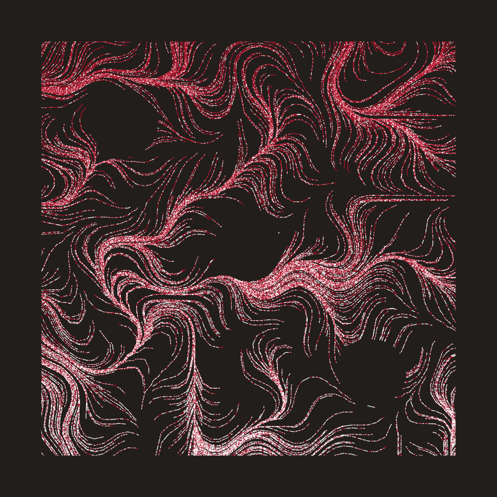

Hello! 

Just wanted to share some new techniques I learned while working on [week 7 of #RecreationThursday challenge](https://twitter.com/kelsey_chalmers/status/1430875667793682432). Specifically, we'll focus on using the flow field to draw smooth curves.  

I ended up submitting this, but I got so much better while writing this blog post!

{width=30%}

I mainly tried to find the right parameter combinations that work with certain colours, by trial and error. Here are some of my favourites.

{width=30%} {width=30%} {width=30%} 

{width=30%} {width=30%} {width=30%}

These are some resources that got me started, as a complete beginner in this area:

- [Tyler Hobbs' essay](https://tylerxhobbs.com/essays/2020/flow-fields) 
- [Generative Garden's Youtube video](https://www.youtube.com/watch?v=JlU3GskkcUw) 

Without further ado, let's first go through the basics, before we start diving into more interesting details.

# Flow Field Basics

The steps I took are:

1. Set up a grid, and store some angles in each item.
2. Drop a point somewhere on the grid (or outside!), and see how it moves, by:
3. Find the grid item that is closest to the current position.
4. Extend the current position with that angle, by a specified amount.
5. Repeat.

We'll start with a 10 x 10 grid, and initialize all items with some angles. I'm just going to fit 0 ~ 2*pi according to the y-position.

I like to start by crossing x/y combinations, because it works so well with `ggplot2`, but we're going to throw it into a matrix for later use (row/col indexing).
```{r message = FALSE}
library(tidyverse)

my_grid <- crossing(
  x = 1:10,
  y = 1:10
) %>% 
  mutate(angle = (y / 10) * 2*pi)

my_flow_field <- matrix(data = my_grid$angle, nrow = 10, ncol = 10)
```

This is what we have:

```{r}
grid_visualized <- my_grid %>% 
  mutate(
    xend = x + cos(angle) * 0.5,
    yend = y + sin(angle) * 0.5
  ) %>% 
  ggplot() +
  geom_segment(aes(x = x, y = y, xend = xend, yend = yend)) +
  geom_point(aes(x = x, y = y)) +
  coord_equal()

grid_visualized
```

We'll drop a couple particles, defined as a tibble containing x/y coords.
```{r}
my_particles <- tibble(
  x = c(2.5, 8.5),
  y = c(2.5, 3.5)
)

grid_visualized +
  geom_point(data = my_particles, aes(x = x, y = y), color = "red", size = 3)
```

Let's perform one iteration of step 3, 4 & 5 from the above. 
 
>3. Find the grid item that is closest to the current position.
>4. Extend the current position with that angle, by a specified amount.
>5. Repeat

To do this, we find the col/row index in the flow field that's closest to the current particle's x/y position. For now, one unit increase in x/y coords, matches one unit increase in col/row in the flow field grid (we'll come back to this later).

Grab that angle in the flow field, and draw a line from the particle at that angle by a specified amount. (say 2.8)

```{r}
get_closest_angle <- function(x, y, flow_field) {
  max_x <- ncol(flow_field)
  max_y <- nrow(flow_field)
  
  closest_x_index <- which(abs(1:max_x - x) == min(abs(1:max_x - x)))[[1]] # Pick the first one, if there's multiple points with same distances
  closest_y_index <- which(abs(1:max_y - y) == min(abs(1:max_y - y)))[[1]] 
  closest_angle <- flow_field[[closest_y_index, closest_x_index]]
  
  return(closest_angle)
}

next_angle <- my_particles %>% 
  pmap_dbl(get_closest_angle, flow_field = my_flow_field)

my_particles <- my_particles %>% 
  mutate(angle = next_angle) %>% 
  mutate(xend = x + cos(angle) * 2.8,
         yend = y + sin(angle) * 2.8)

grid_visualized +
  geom_segment(data = my_particles, aes(x = x, y = y, xend = xend, yend = yend), color = "red") +
  geom_point(data = my_particles, aes(x = x, y = y), color = "red", size = 3)
```

You can keep iterating this, each time, using the newly calculated destination points as the starting x/y coords for the next line to be drawn. 

After 1 more iteration, you end up with this:

```{r echo = FALSE}
next_angle2 <- my_particles %>% # oh god please don't let anyone see this code chunk
  select(x = xend, y = yend) %>% 
  pmap_dbl(get_closest_angle, flow_field = my_flow_field)

particle2 <- my_particles %>% 
  select(x = xend, y = yend) %>% 
  mutate(angle = next_angle2) %>% 
  mutate(xend = x + cos(angle) * 2.8,
         yend = y + sin(angle) * 2.8)

my_particles <- my_particles %>% 
  rbind(particle2)

grid_visualized +
  geom_segment(data = my_particles, aes(x = x, y = y, xend = xend, yend = yend), color = "red") +
  geom_point(data = my_particles, aes(x = x, y = y), color = "red", size = 3)
```

That's it! This is all you need to understand to get started with the flow field. After this, it's just playing around with parameters to explore your creativity! 

# Beyond the Basics
  
I broke down the workflow above, into 3/4 controllable functions.

1. `generate_flow_field`
2. `start_particles`
3. `draw_curve` + `step_into_next_curve_segment`

In short, these work together to define a flow field with perlin noise, sprinkle some particles, and track how they move.

Chaining all the functions together was a little manual, so I won't cover that, but if you're interested, check my [github](https://github.com/jiwanheo/RecreationThursday/blob/main/week07/code.Rmd).

## 1. `generate_flow_field`

**What it does:** Generate a square flow field. This time with a width, as opposed to # columns. 

We'll still control how many rows/cols to fit into that given width/height, using a `resolution_factor`. Also, instead of y-scaling the angles, let's use perlin noise to generate semi-random patterns.

```{r}
library(ambient)

generate_flow_field <- function(flow_field_width = 1000, 
                                resolution_factor = 0.025,
                                perlin_scale_factor = 0.005,
                                perlin_seed,
                                perlin_freq) {
  
  resolution <- flow_field_width * resolution_factor 
  num_cols <- flow_field_width %/% resolution
  num_rows <- num_cols
  
  long_grid_ff <- ambient::long_grid(x = 1:num_cols,
                                     y = 1:num_rows) %>%
    mutate(x = x * perlin_scale_factor,
           y = y * perlin_scale_factor) %>% 
    mutate(angle = ambient::gen_perlin(x, 
                                       y,
                                       seed = perlin_seed,
                                       frequency = perlin_freq))
  
  # normalize angles to be between 0 & 2pi
  min_per <- min(long_grid_ff$angle)
  max_per <- max(long_grid_ff$angle)
  
  long_grid_ff <- long_grid_ff %>% 
    mutate(angle = (angle-min_per) / (max_per-min_per) *  (2*pi-0) + 0)
  
  my_flow_field <- matrix(data = long_grid_ff$angle,
                          ncol = num_cols,
                          nrow = num_rows)
  
  visualized_flow_field <- crossing(
    x = 1:num_cols,
    y = 1:num_rows
  ) %>% 
    mutate(angle = map2_dbl(x, y, ~my_flow_field[[.y, .x]])) %>% 
    mutate(xend = x + cos(angle) * 0.5,
           yend = y + sin(angle) * 0.5) %>% 
    mutate(x_index = x, y_index = y) %>% 
    mutate(across(c(x, y, xend, yend), ~ .x * resolution))
  
  list(my_flow_field, visualized_flow_field)
}
```

### Parameter: Resolution

Resolution determines how fine of a flow field we want, therefore the overall smoothness of the output.

Here's small vs big `resolution_factor`, all else equal.

{width=40%} {width=40%}

The choppy look on the right makes sense, because the underlying flow field doesn't have too many angles to work with.

{width=40%} {width=40%}

### Parameter: Perlin Noise

Perlin noise generates a semi-random sequence of numbers, in a way that all items are somewhat similar to their immediate neighbours. This sounds pretty confusing. But for now, all we have to know is, that we can feed the sequence of row/col grid indexes, to get back some interesting and smooth sequence of noise (same length).

After some research, I got a decent understanding of how perlin noise worked, but I relied heavily on Thomas Lin Pedersen' [ambient package](https://github.com/thomasp85/ambient) for the actual maths part. 

There's a ton of good resources if you want to learn more. I liked [The Coding Train on YouTube](https://www.youtube.com/watch?v=8ZEMLCnn8v0) and [Eevee's blog post](https://eev.ee/blog/2016/05/29/perlin-noise/).  

#### Perlin Noise - scale

`perlin_scale_factor` controls how large of a perlin noise sequence we want to look at. It scales our row/col index sequence, before feeding them to the `ambient::gen_perlin` transformation. 

The larger the scale factor, the longer the length of the noise sequence. On the other hand, if the factor is small, we zoom in to a small part of the sequence, resulting in less craziness.

Here's small vs big `perlin_scale_factor`

{width=30%} {width=30%}

On the left, the curves are wider and slower, whereas on the right, the curves are more hairy, because we run it through a wider range of noise sequence.

#### Perlin Noise - seed

`perlin_seed` is just a seed used for the noise generating process. Here are some variations of my favourite piece:
{width=30%} {width=30%} {width=30%}

{width=30%} {width=30%} {width=30%}

#### Perlin Noise - frequency

The documentation of `ambient::gen_perlin` says:

> frequency determines the granularity of the features in the noise.

I really didn't understand how exactly this parameter works, but I did observe, that the higher the frequency, the more rigid the outcome looked. These do come into play in colour selection. More on that later!

Anyway, here's small vs big `perlin_freq`

{width=30%} {width=30%}

Tuning `perlin_freq` and `perlin_scale_factor` at the same time gives you some interesting results. Highly recommended.

And that's it for this function! We now have a flow field to work with. 

## 2. `start_particles`

**What it does:** Populate some particles

I sampled the starting x/y points from a uniform distribution with 10% padding on the flow field width/height from both ends.

```{r}
start_particles <- function(n_out = 800,
                            flow_field_width,
                            num_steps,  
                            step_length,
                            flow_field,
                            resolution_factor)
{      
  df <- tibble::tibble(
    start_x = runif(flow_field_width*-0.1, flow_field_width*1.1, n=n_out),
    start_y = runif(flow_field_width*-0.1, flow_field_width*1.1, n=n_out)
  ) %>%
    mutate(row_num = row_number(),
           resolution = flow_field_width * resolution_factor,
           num_steps = num_steps,
           step_length = step_length)
  
  df %>% 
    pmap_dfr(draw_curve, 
             flow_field = flow_field)
}
```

### Parameter: n_out

The only parameter we really use here is `n_out`, which specifies the number of particles to drop. The rest, we pass onto `draw_curve`, to kick-start the curve generating process.

Here's `n_out` at 200 vs 400 vs 1000

{width=30%} {width=30%} {width=30%}

While the drawing gets more details with increasing `n_out`, if done too much, you start to get "clumps" of lines, which may or may not be desirable.  

## 3. `draw_curve` & `step_into_next_curve_segment`

**What it does:** Simulate curve movement, and save the result

This is where the action unfolds. `draw_curve` starts the curve drawing process (... well, a collection of small lines). We begin by creating a vector of length: `num_steps`+1, and store the starting x/y of a particle as the first item. From there, we calculate where the particle will move to next, with `step_into_next_curve_segment`. We'll call it `num_steps` times, storing the results each time.

### 3.1 `draw_curve`

```{r}
draw_curve <- function(start_x, 
                       start_y, 
                       row_num, 
                       flow_field, 
                       resolution, 
                       left_x = 1 * resolution, 
                       bot_y  = 1 * resolution,
                       num_steps,   
                       step_length) 
{ 
  
  x_container <- vector("numeric", num_steps+1)
  y_container <- vector("numeric", num_steps+1)
  
  x_container[1] <- start_x
  y_container[1] <- start_y
  
  
  # grid dimension range
  x_dim_range <- 1:ncol(flow_field) 
  y_dim_range <- 1:nrow(flow_field)
  
  # With the rest of num_steps, move through the flow field, 
  # Each time, stepping towards the closest angle we can grab.
  for (i in 1:num_steps) {
    
    next_step <- step_into_next_curve_segment( 
      start_x     = x_container[i], 
      start_y     = y_container[i],
      left_x      = left_x,
      bot_y       = bot_y,
      resolution  = resolution,
      x_dim_range = x_dim_range,
      y_dim_range = y_dim_range,
      flow_field  = flow_field,
      step_length = step_length
    )
    
    x_container[i+1] <- next_step$x
    y_container[i+1] <- next_step$y
    
  }
  
  tibble::tibble(
    x = x_container,
    y = y_container,
    row_num = row_num 
  ) %>%               
    dplyr::mutate(plot_order = dplyr::row_number())  
}
```

Notice the return value of this function (tibble containing x/y coordinates) has two different id columns, `row_num` & `plot_order`, for line-specific & segment-of-a-line-specific groupings. We'll use this for colours later. 

#### Parameter: num_steps & step_length 

These two parameters control the overall texture/feel of the "brush stroke"s. 

`num_steps` controls how many times we want to extend our particles. Here's `num_steps` 500 vs 2000 at `step_length` == 0.001

{width=30%} {width=30%}

`step_length` controls how long each line segment should extend from its previous positions. Here's `step_length` 0.001 vs 0.005 at `num_steps` == 2000 (*different seed from above)

{width=30%} {width=30%}

They *can* be redundant in some situations, and look very similar. Try experimenting these with other parameters, like `resolution_factor`, `perlin_scale_factor`, `perlin_freq` and colours. 

### 3.1 `step_into_next_curve_segment`

**What it does:** Calculate the next movement of a particle, and return its x/y position.

This is the workhorse of the whole process. Thankfully, we've already looked at something similar to this in the basics section above.

There's really no parameters to play with here, everything has been decided before reaching this function. 

```{r}
step_into_next_curve_segment <- function(start_x, 
                                         start_y,
                                         left_x,
                                         bot_y,
                                         resolution,
                                         x_dim_range,
                                         y_dim_range,
                                         flow_field,
                                         step_length) 
{
  # Get the current x/y position (in relation to grid size)
  x_offset <- start_x - left_x
  y_offset <- start_y - bot_y
  
  # Scale it down, to match grid dimension
  curr_x_index <- round(x_offset / resolution, digits = 0)
  curr_y_index <- round(y_offset / resolution, digits = 0)
  
  # Find the closest point on the grid at each x/y 
  closest_x_index <- which(abs(x_dim_range - curr_x_index) == min(abs(x_dim_range - curr_x_index)))[[1]]
  closest_y_index <- which(abs(y_dim_range - curr_y_index) == min(abs(y_dim_range - curr_y_index)))[[1]]
  
  # Grab that angle
  closest_angle <- flow_field[[closest_y_index, closest_x_index]]
  
  # Extend the current line into that angle (scale it up again)
  x_step  <- step_length * cos(closest_angle) * resolution
  y_step  <- step_length * sin(closest_angle) * resolution
  res_x <- start_x + x_step
  res_y <- start_y + y_step
  
  list(x = res_x, y = res_y)
  
}
```

And... You've made it! That's how everything fits in together! 🎉

# Final touch - colours

We're almost there! Hear me out for a second while I put a finishing touch to our art piece with some colour work. 

If you've noticed so far, I've been mixing in 3-4 different colours. 

- Background 
- Circle (sometimes same as background)
- 2-colour gradient to fill in the lines. 

To make the 2-colour gradient work, I filled every single line segment (of length `step_length`) separately, by sampling 2 colours with weights based on y-location. (one colour is more dominant at the top) Like so:

{width=40%} {width=40%}

But here's the catch. Remember the awkward wording I had on groupings in function #3, `draw_curve`?

> Notice the return value of this function has two different id columns, `row_num` & `plot_order`, for line-specific & segment-of-a-line-specific groupings. We'll use this for colours later. 

Using these id columns, I can apply my colour palettes at either line or segment level. So far, I've been mostly doing segment colouring, but there are 2 line colouring methods that I explored. (weighted on mean y of line vs starting y of line) 

Left-to-right: segment, line-mean, line-start

{width=30%} {width=30%} {width=30%}

The difference between 2 line methods is subtle. You'll notice that there's more blue flowing into the bottom right corner, because those lines started in the upper half of the picture.

# Conclusion

Hope you enjoyed this tutorial! I absolutely loved working on this, and writing this blog post really took my understanding of this concept to a new level. If you've read this far, you can do everything I've shown here, without a doubt. There's a ton of things you can do with this concept, and I encourage you to explore all the possibilities!