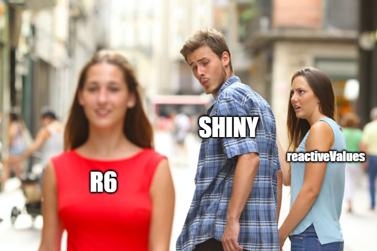
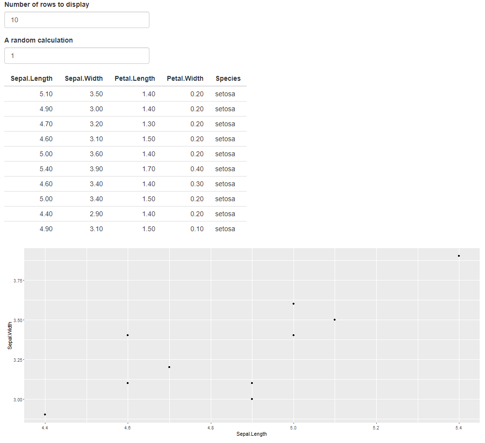
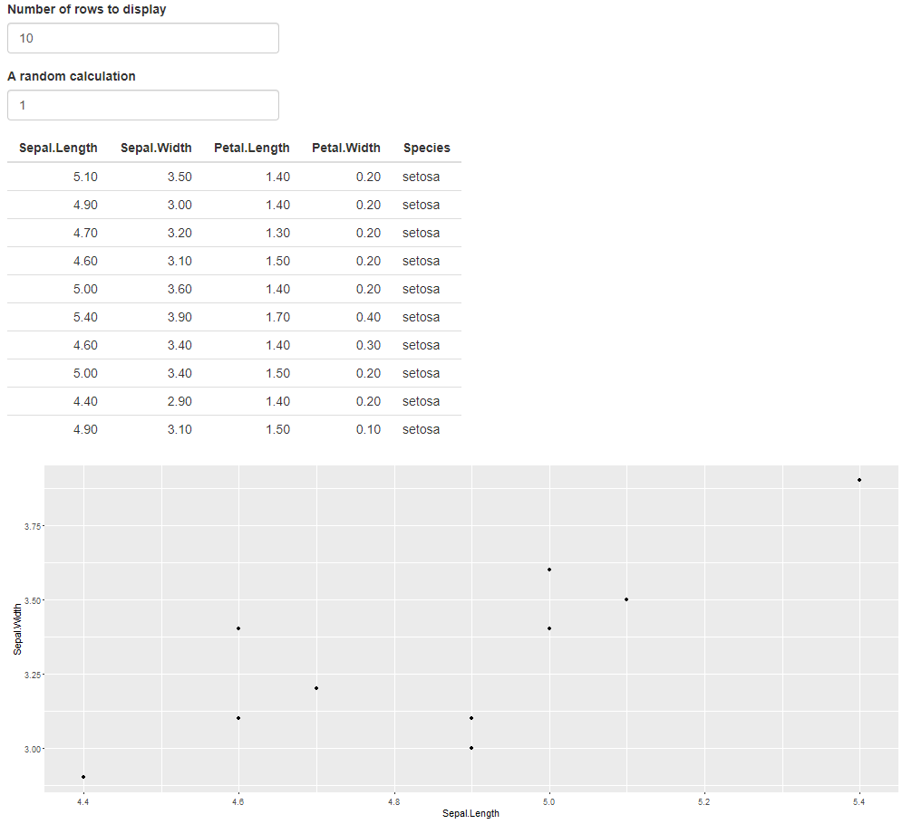
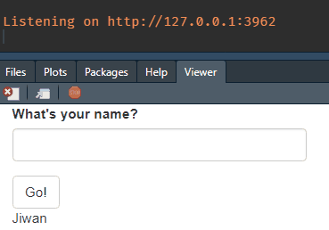
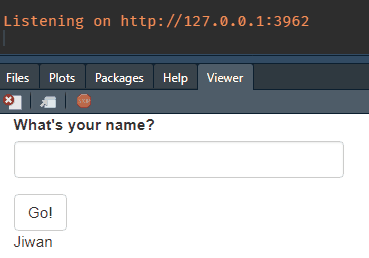
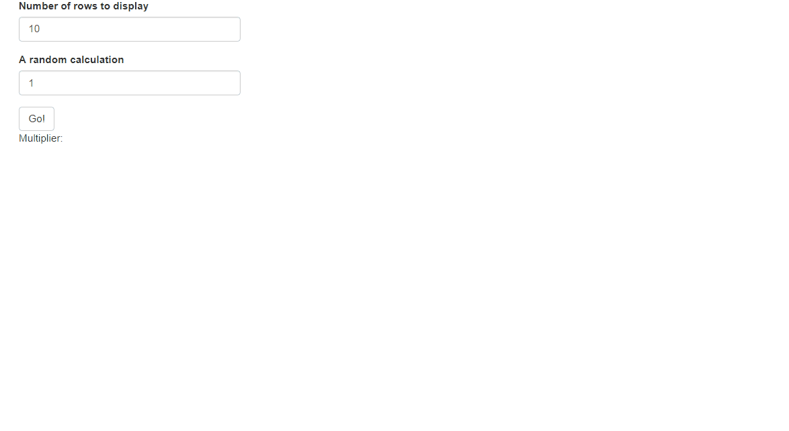

You have a nice shiny app that manipulates data based on user input, carries out some analysis, and displays the results back to the user. Great! Now it's time to clean up some code, and break out the ui.R & server.R into modules. Uh-oh, all of a sudden, my app's not working!

Does this sound familiar? It definitely happened to me countless of times. Today, I want to talk about an efficient way to modularize your Shiny app using R6.



## Setup

Here's a simple shiny app that takes 2 inputs from the user to manipulate the iris dataset, and generate a table and a graph. Notice the `iris_dat` reactive that manipulates the data.

```{r message = FALSE, warning = FALSE}
library(shiny)
library(dplyr)
library(ggplot2)

ui <- fluidPage(
  numericInput("n_rows", 
               "Number of rows to display",
               value = 10,
               min = 1,
               max = nrow(iris)),
  
  numericInput("multiplier", 
               "A random calculation",
               value = 1,
               min = 1,
               max = 10),
  
  tableOutput("table"),
  plotOutput("graph")
)

server <- function(input, output, session) {
  
  iris_dat <- reactive(
    iris %>% 
      head(input$n_rows) %>% 
      mutate(Sepal.Length = Sepal.Length * input$multiplier)
  )
  
  output$table <- renderTable({
    iris_dat()
  })
  
  output$graph <- renderPlot({
    iris_dat() %>% 
      ggplot(aes(Sepal.Length, Sepal.Width)) +
      geom_point()
  })
}

# shinyApp(ui, server)
```



This app.R works. But you can imagine how long this file would get as you add more components. 

Let's see how they teach you to modularize your code.

## Modularization - classic reactive

The above shiny app has 3 components.

- Taking input and manipulating data
- Generate table
- Generate graph

We'll turn these components into their own modules.

- mod_manip.R
- mod_table.R
- mod_graph.R

**mod_manip.R**

- This module manipulates iris and returns the `iris_dat` reactive.

```{r}
mod_manip_ui <- function(id) {
  ns <- NS(id)
  
  tagList(
    numericInput(ns("n_rows"), 
                 "Number of rows to display",
                 value = 10,
                 min = 1,
                 max = 150),
    
    numericInput(ns("multiplier"), 
                 "A random calculation",
                 value = 1,
                 min = 1,
                 max = 10)
  )
}

mod_manip_server <- function(id) {
  moduleServer(id, function(input, output, session) {
    
    iris_dat <- reactive(
      iris %>% 
        head(input$n_rows) %>% 
        mutate(Sepal.Length = Sepal.Length * input$multiplier)
    )
    
    return(iris_dat)
  })
}
```

**mod_table.R**

- This module takes a `dat` argument in the server, and displays it as a table in the UI. Notice we're invoking `dat()`, as we would with any other reactive.

```{r}
mod_table_ui <- function(id) {
  ns <- NS(id)
  tableOutput(ns("table"))
}

mod_table_server <- function(id, dat) {
  moduleServer(id, function(input, output, session) {
    
    output$table <- renderTable({
      dat()
    })
    
  })
}
```

**mod_graph.R**

- This is the same thing as `mod_table`, but with a plot.

```{r}
mod_graph_ui <- function(id) {
  ns <- NS(id)
  plotOutput(ns("graph"))
}

mod_graph_server <- function(id, dat) {
  moduleServer(id, function(input, output, session) {
    
    output$graph <- renderPlot({
      dat() %>% 
        ggplot(aes(Sepal.Length, Sepal.Width)) +
        geom_point()
    })
    
  })
}
```

Putting these all together, our app.R now looks a lot more readable:

```{r}
ui <- fluidPage(
  mod_manip_ui("mod_manip_1"),
  mod_table_ui("mod_table_1"),
  mod_graph_ui("mod_graph_1")
)

server <- function(session, input, output) {
  iris_dat <- mod_manip_server("mod_manip_1")
  mod_table_server("mod_table_1", dat = iris_dat)
  mod_graph_server("mod_graph_1", dat = iris_dat)
}

# shinyApp(ui, server)
```



Great start! We now have 3 modules that each represent a component of our Shiny app. This app still works, because the reactivity chain is respected across modules.

You can definitely stop here and call it a day. But if you want to take it a little further, think about these points:

- If you want to access `input$multiplier` in `mod_table_server`, how do you do it?
- How do you make sure the `iris_dat` is calculated correctly, and passed correctly to other modules?

While these are definitely doable tasks, they require a little more work.

- Have `mod_manip_server` return two things, the `input$multipler`, as well as `iris_data.` Then have `mod_table_server` receive another argument `multiplier`
- Manually check the app, or use `shiny::testServer` to test the server logic. 

Buuuuuuuuuuuuuuuuut,

What if we used R6?

- Access the `multiplier` public field in an R6 object, from anywhere!
- Use `test_that` framework to test the logic automatically.

## Modularization - R6

{width=50%}

R6 is an object oriented programming system that can hold data and functions. It's useful because when these data fields are modified inside a module, these modified values are available in the global environment. This means we can hold the entire data reading/manipulating/outputting process inside a single object, and interact with it from anywhere.

`R6::R6Class` is the only function you use. At minimum, it takes as arguments, the class name, and a list of information (data and functions), that can be read and written from anywhere. 
```{r}
ExampleR6 <- R6::R6Class(
  "ExampleR6",
  public = list(
    name = "Jiwan"
  )
)
```

You can create a new instance of this object, by :

```{r}
example1 <- ExampleR6$new()
example1
```

Ignore that "clone" thing, what's important is that there's a field named, "name", with a value "Jiwan".

You can interact with it like so:

```{r}
example1$name <- "Not Jiwan"
example1
```

That's about all you need to know. let's dive straight into using this in Shiny modules.

### R6 Example app 

To use R6 in your modules, all you have to do is create an instance of the R6 object, and pass them to the desired modules' server functions. Notice the `r6` arguments in the 2 modules below.

`mod_1` takes a text input from user, and when actionButton is pressed, it updates r6's name field.

```{r}
mod_1_ui <- function(id) {
  ns <- NS(id)
  
  tagList(
    textInput(ns("input_name"), "What's your name?"),
    actionButton(ns("go"), "Go!")
  )
}

mod_1_server <- function(id, r6) {
  moduleServer(id, function(input, output, session) {
    observeEvent(input$go, {
      r6$name <- input$input_name
      print(r6$name) # Print to console the r6's name field
    })
  })
}
```

`mod_2` prints out the r6's name field.

```{r}
mod_2_ui <- function(id) {
  ns <- NS(id)
  
  textOutput(ns("output_name"))
}

mod_2_server <- function(id, r6) {
  moduleServer(id, function(input, output, session) {
    renderText(r6$name)
  })
}
```

Now if you run this Shiny app...

```{r}
ui <- fluidPage(
  mod_1_ui("mod_1"),
  mod_2_ui("mod_2")
)

server <- function(session, input, output) {
  
  # Create an instance of the R6 class
  hello_r6 <- ExampleR6$new()
  
  # Pass the instance of R6 to the modules.
  mod_1_server("mod_1", r6 = hello_r6)
  mod_2_server("mod_2", r6 = hello_r6)
}

# shinyApp(ui, server)
```

It doesn't work.



Why isn't the textOutput updating, even though r6 is working (printing in the console correctly)? 

### Custom Reactivity

It's because `mod_2` has no idea that r6 is being updated, because the two modules are not connected by a reactivity.

This is when [{gargoyle}](https://github.com/ColinFay/gargoyle) comes in. 

{gargoyle} has three main functions, `init()`, `trigger()`, `watch()`. The main idea is painfully clever. `init` sets a numeric reactiveVal to the session, `trigger` adds +1 to the reactiveVal, and `watch` listens to this event.

That's literally it. 

What's good about this, is that we can control/set off the reactivity exactly when we want it, across modules.

The source code is really short, so you can just define those functions on your own if you don't want another package dependency, like I've done in my [most recent Shiny app.](https://github.com/jiwanheo/senTWEETment/blob/master/R/utils_trigger.R)

Now, let's re-visit the above example.

```{r}
mod_1_ui <- function(id) {
  ns <- NS(id)
  
  tagList(
    textInput(ns("input_name"), "What's your name?"),
    actionButton(ns("go"), "Go!")
  )
}

mod_1_server <- function(id, r6) {
  moduleServer(id, function(input, output, session) {
    observeEvent(input$go, {
      r6$name <- input$input_name
      
      gargoyle::trigger("change_name") # Tell mod_2 to update, everytime input$go is clicked
      
      print(r6$name)
    })
  })
}
```

```{r}
mod_2_ui <- function(id) {
  ns <- NS(id)
  
  textOutput(ns("output_name"))
}

mod_2_server <- function(id, r6) {
  moduleServer(id, function(input, output, session) {
    
    # watch for the trigger in from mod_1
    observeEvent(gargoyle::watch("change_name"), {
      renderText(r6$name)
    })
  })
}
```

```{r}
ui <- fluidPage(
  mod_1_ui("mod_1"),
  mod_2_ui("mod_2")
)

server <- function(session, input, output) {
  second_r6 <- ExampleR6$new()
  
  # Set up the initial trigger
  gargoyle::init("change_name")
  
  mod_1_server("mod_1", r6 = second_r6)
  mod_2_server("mod_2", r6 = second_r6)
}

# shinyApp(ui, server)
```



Yay! It's working!! 🎉 Pretty cool huh? 

Please refer to [Advanced R chapter](https://adv-r.hadley.nz/r6.html#r6), and [Engineering Shiny chapter](https://engineering-shiny.org/common-app-caveats.html#building-triggers-and-watchers) for the details I didn't cover here.

Let's dive back into the iris problem. 

## Implementation

Armed with this knowledge from above, our strategy to modularize the iris app is:

- Have all module server functions take as argument, an r6 object
- Modules interact directly with the r6
  - `mod_manip` updates r6, and trigger reactive events
  - `mod_table` & `mod_graph` listen for changes, to retrieve data from r6 when needed
- Create an instance of the R6 class in server.R, and call all the modules with it

Here's the R6 definition we'll use for the iris app: 

```{r}
IrisR6 <- R6::R6Class(
  "IrisR6",
  public = list(
    n_rows = NULL,
    multiplier = NULL,
    orig_data = iris,
    res_data = NULL,
    manip_data = function(dat) {
      dat %>% 
        head(self$n_rows) %>% 
        mutate(Sepal.Length = Sepal.Length * self$multiplier)
    }
  )
)
```

- The first three fields represent the components of `mod_manip`, 
- The function `manip_data` replicates the data manipulating logic. We'll call this from `mod_manip`
- And we'll save the resulting dataframe in to `res_data` field from the same module

**mod_manip.R**

- Added an actionButton to the UI, to make it explicit when we want to update r6
- The server function now takes `r6` as an argument, instead of `dat`.
- When "go" is pressed, we save the parameters to `r6`, execute the `manip_data` function, and save the result into itself.
- Trigger the "update_iris" event

```{r}
mod_manip_ui <- function(id) {
  ns <- NS(id)
  
  tagList(
    numericInput(ns("n_rows"), 
                 "Number of rows to display",
                 value = 10,
                 min = 1,
                 max = 150),
    
    numericInput(ns("multiplier"), 
                 "A random calculation",
                 value = 1,
                 min = 1,
                 max = 10),
    actionButton(ns("go"), "Go!")
  )
}

mod_manip_server <- function(id, r6) {
  moduleServer(id, function(input, output, session) {
    
    observeEvent(input$go, {
      r6$n_rows <- input$n_rows
      r6$multiplier <- input$multiplier
      
      new_data <- r6$manip_data(dat = r6$orig_data)
      r6$res_data <- new_data
      
      gargoyle::trigger("update_iris")
    })
    
  })
}
```

**mod_table.R**

- The server function yet again takes `r6` as argument, rather than `dat`
- I added a textOutput in UI, to demonstrate we can get `input$multiplier` from anywhere.
- Watch for the "update_iris" event to update output
- Notice we're not invoking `r6$res_data` with brackets.

```{r}
mod_table_ui <- function(id) {
  ns <- NS(id)
  tagList(
    textOutput(ns("text")),
    tableOutput(ns("table"))
  )
}

mod_table_server <- function(id, r6) {
  moduleServer(id, function(input, output, session) {
    
    observeEvent(gargoyle::watch("update_iris"), {
      
      output$text <- renderText(paste("Multiplier:", r6$multiplier))
      
      output$table <- renderTable({
        req(!is.null(r6$res_data))
        
        r6$res_data
      })
      
    })
  })
}
```

**mod_graph.R**

- And more of the same thing.

```{r}
mod_graph_ui <- function(id) {
  ns <- NS(id)
  plotOutput(ns("graph"))
}

mod_graph_server <- function(id, r6) {
  moduleServer(id, function(input, output, session) {
    
    observeEvent(gargoyle::watch("update_iris"), {
      
      output$graph <- renderPlot({
        req(!is.null(r6$res_data))
        
        r6$res_data %>% 
          ggplot(aes(Sepal.Length, Sepal.Width)) +
          geom_point()
      })
      
    })
  })
}
```

**ui & server**

- I changed the ui layout a little, but nothing else changed.
- In server, `IrisR6$new()` creates a new instance of the IrisR6 object. 
- This r6 object will be passed into the 3 modules.
- "update_iris" custom reactivity event is initialized.

```{r}
ui <- fluidPage(
  column(12, mod_manip_ui("mod_manip_1")),
  column(6, mod_table_ui("mod_table_1")),
  column(6, mod_graph_ui("mod_graph_1"))
)

server <- function(session, input, output) {
  
  r6 <- IrisR6$new()
  gargoyle::init("update_iris")
  
  mod_manip_server("mod_manip_1", r6 = r6)
  mod_table_server("mod_table_1", r6 = r6)
  mod_graph_server("mod_graph_1", r6 = r6)
}

# shinyApp(ui, server)
```

And the app looks solid!



## Bonus

Remember that `test_that` thing I brought up? 

Because we're not using reactivity, we can test the logic of this Shiny app, just like we would a regular function. This is great especially if your shiny app is built on top of {golem}. Here's how a test-iris_shiny_app.R might look like (not executed cuz blog)

```{r eval = FALSE}
library(testthat)
test_that("Iris manipulation works in R6", {
  
  r6 <- MyR6$new()
  
  r6$n_rows <- 5
  r6$multiplier <- 10
  new_data <- r6$manip_data(dat = r6$orig_data)
  r6$res_data <- new_data
  
  espect_equal(nrow(r6$res_data), 5)
  espect_equal(max(r6$res_data$Sepal.Length), 79)
})
```

## Summary

There you have it! I hope you learned something from this blog post :) 

For a small shiny app, this may be an overkill, but if you have a shiny app that does a lot of data processing, I recommend using this approach, rather than juggling through that logic in you modules, and having to keep track of it everywhere.

In this blog post, we learned:

- Do modularize your shiny app!
- Basics of R6 in Shiny
- Custom reactive event with {gargoyle}
