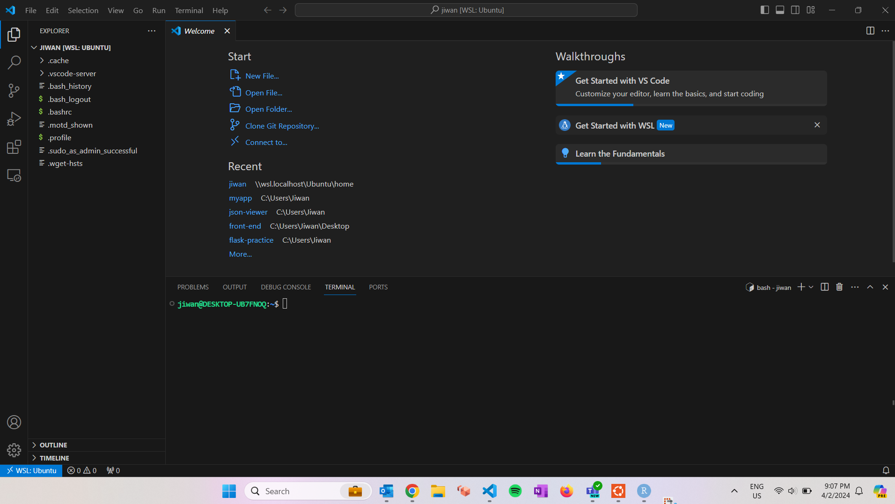
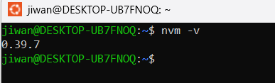

In this series of blog posts, we'll walk through the process of making a simple
node application with a React front end that interacts with a Postgres database
through express API. Then, we'll deploy this on AWS EC2, and set it up
with DNS and SSL to allow access through the web.

## Tech stack

### OS

I'm developing on a Windows laptop, with [WSL](https://ubuntu.com/desktop/wsl),
which is basically a Linux VM on Windows that's very easy to set up. After you 
set up WSL, you'll want to run `sudo apt-get update` & `sudo apt-get upgrade`.

### IDE

I'll be using VS Code on WSL, which means the VS Code will see the folders/files
on the Linux environment, but the application will still run on Windows, this is
nice because we don't have to install VS Code in WSL. Just run `code .` from WSL to launch VS Code on your Windows desktop, but the 
folders/files it sees is in Linux. Notice the explorer bar on the side and the terminal on the bottom says Ubuntu.

### Framework

As mentioned before, we'll make a node app.

So we'll need to install node. They recommend using 
[nvm](https://github.com/nvm-sh/nvm). On WSL terminal, run

`curl -o- https://raw.githubusercontent.com/nvm-sh/nvm/v0.39.7/install.sh | bash`

Close and re-open the terminal, and run `nvm -v` to see if it installed 
correctly. You should see something like this.

Then run `nvm install node` to install node. Run `node -v` to see if it 
installed correctly.

Success!

### Cloud 

We'll be using AWS EC2.

