This is Part 1 of my Fullstack app series. If you haven't read the [previous part]("https://jiwanheo.rbind.io/post/2024-04-02-fullstack-app-part-0-big-picture/"), 
where I outline what we'll do with the project, please make sure to check it out before this one!

In this post, we'll make a simple bookmark app. Users will be able to save a URL
of a webpage they like, and view it later through this app! You'll learn how to 
set up a postgres database, hook it up to express API server, which the react 
app will communicate through Axios client.

It'll look like this at the end.

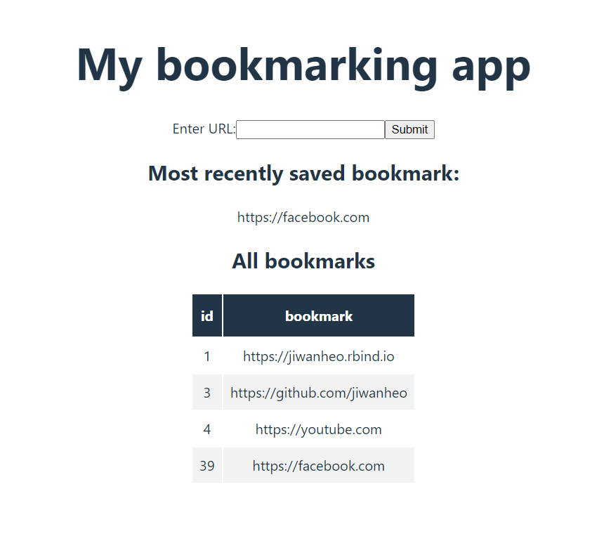

- A form to enter and save URL
- A text UI to see the most recent bookmark
- A table UI for seeing all the bookmarks

In API language, this is 1 POST request, and 2 GET requests that we'll have to
implement - one for seeing the latest bookmark, and another to query all 
bookmarks.

We'll follow this order of things to do:
- Set up Vite project
- Set up Postgres database
- Set up Express API
- Make React App
- Connect React with Express through Axios

Where we'll do the last two steps together.

## Set up Vite

Let's use Vite as our development server, and start a project called "bookmark-app". Run

```
npm create vite@latest bookmark-app
```

It's going to ask to install package and select
a few options. I'm not going to do anything fancy and go react/javascript.

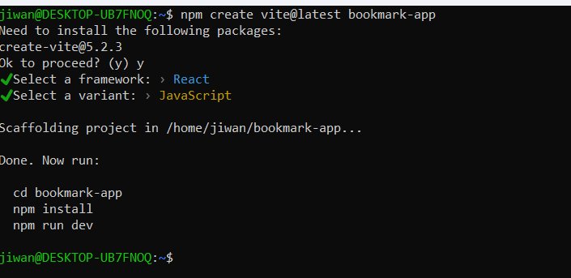

Vite follows ES6, as opposed to Common JS, which means
we can't use `require` to import stuff, instead, we'll have to use `import`.

I'll run the code suggested in the terminal. If you see this screen, you did it 
correctly!

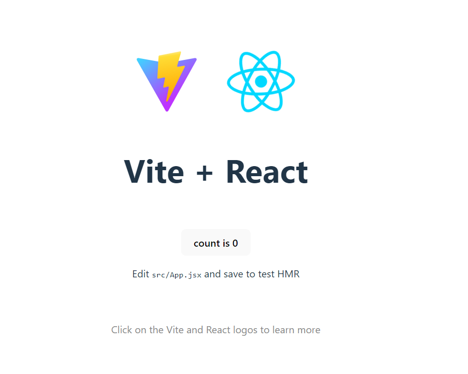

Now from the WSL terminal, you should already be cd'd into the project. 
You can run `code .` to open VS code.

### Folder structure

Before we dive into coding, we're going to do a little folder structuring to 
follow the 
[Model-View-Controller (MVC) architecture pattern](https://www.linkedin.com/pulse/understanding-mvc-nodejs-comprehensive-guide-vishwas-acharya-xpxgf/).
This allows us to separate our logics nicely so we don't step on each others' toes.

- Model is responsible for the database piece. We'll create our database object 
here, that the rest of the app can use.

- View is responsible for presenting data to the user. This is the React app + 
Axios logic. We'll go a step further, and separate out the Axios logic into its
separate thing called "store".

- Controller is responsible for receiving requests from view, and processing them.
This is where we write our Express API routing logic.

To start, we'll separate out the backend and front end. On the project root 
folder, create two folders called "backend" & "frontend". Then move the `public` 
and `src` folders there. Because we moved the `main.jsx` file that Vite uses as 
entry point, we'll need to update line 11 of `index.html` at the root folder to
point to the new location.

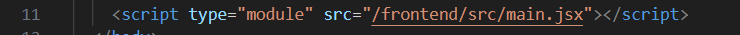

Now, in the backend folder, create the following folders/files

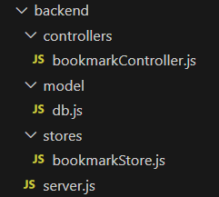

The three folders and its files correspond to the MVC structure above, and the 
`server.js` file is where we'll instantiate the Express API.

By now, your folder structure should look like this

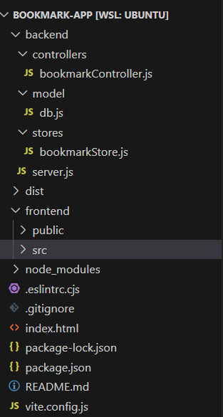

Ok that's it! Let's get to coding!

## Set up Postgres database

First and foremost, we'll create our database to store our bookmarks.

I followed the [documentation](https://www.postgresql.org/download/linux/ubuntu/)
and ran the code they have there on the WSL terminal.

```
sudo sh -c 'echo "deb https://apt.postgresql.org/pub/repos/apt $(lsb_release -cs)-pgdg main" > /etc/apt/sources.list.d/pgdg.list'

wget --quiet -O - https://www.postgresql.org/media/keys/ACCC4CF8.asc | sudo apt-key add -

sudo apt-get update

sudo apt-get -y install postgresql
```

If you're able to run `sudo -i -u postgres` to log in as postgres user, you've 
installed it correctly.

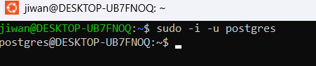

Now, let's create a database called `mydb`, and within it, a table called 
`bookmarks`. It will have just 2 columns, auto-incrementing "ID", and "bookmark". 
We'll fill it with one row of data.

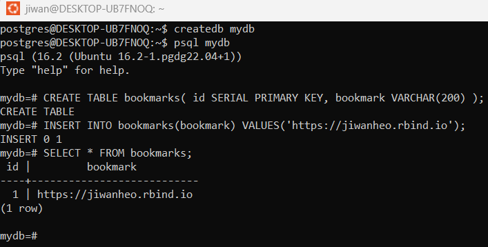

I'll create a role for this db and grant access, so that we're not doing 
everything as the master user. Run the following codes while you're in `mydb`.
This can be a little confusing!

```
CREATE ROLE mydb_role WITH LOGIN PASSWORD 'some_password';
```
> As the root user, we're going to create a role called "mydb_role", which is
basically a user who is not the root user

```
GRANT SELECT, UPDATE, INSERT ON bookmarks TO mydb_role;
```
> We're granting a table-specific privileges to perform SELECT, UPDATE, INSERT
operations to the "mydb_role" role

```
GRANT USAGE, SELECT ON ALL SEQUENCES IN SCHEMA public TO mydb_role;
```

> Schema is a collection of tables, views, sequences, and others. Postgres automatically
creates a schema called `public` for every new database. If we don't specify a 
schema name when creating objects, postgres puts it in the `public` schema.
SEQUENCES are used to populate incrementing (serial) IDs. To use this feature,
we need to grant USAGE privilege on SEQUENCES, where USAGE allows access to 
objects contained in it.

Make sure you're in the mydb database before you run these 
(the terminal indicates `mydb=#`). If not, you can check it out with `\c mydb`. 

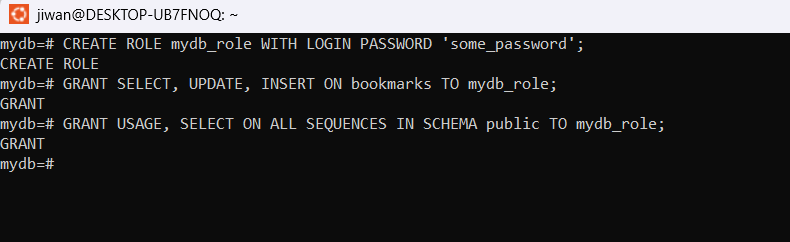

Now back out of the psql shell, by running `\q`. We're essentially logging out
as `postgres` role. Now, let's log in as `mydb_role` role by running 

```
psql -h localhost -d mydb -U mydb_role
```

Which means you'll connect to the localhost server **h**ost, mydb **d**atabase, 
as mydb_role **u**ser

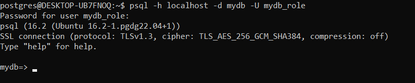

Finally, let's check if the `mydb_role` can read/write to the `bookmarks` db.

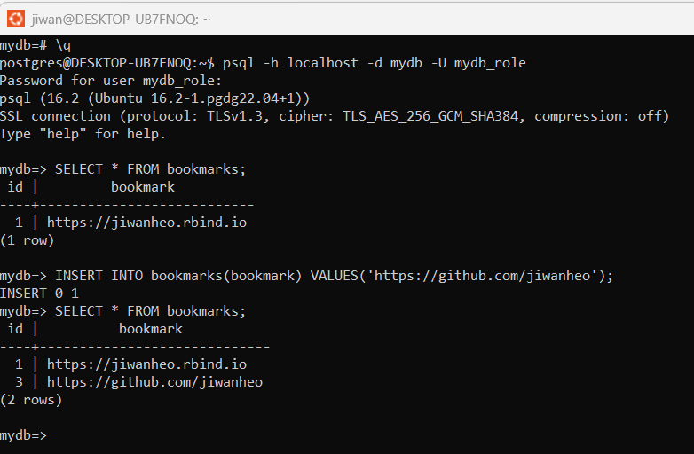

Looks good to me! Now, we'll set up a script so the rest of the Node app can access it.

Install `pg`, a PostgreSQL client for Node.js.

```
npm install pg
```

Open "model/db.js", and paste in this code. This imports the Pool class, which
allows multi-user access to the db. Then, we create an instance of it with our
login creds. (This should be done with environment variables, please don't hard
code in real life applications!) 

```
import postgresql from "pg";
const { Pool } = postgresql;

export default (callback = null) => {
  const pool = new Pool({
    user: "mydb_role",
    password: "some_password",
    host: "localhost",
    port: 5432,
    database: "mydb",
  });
}
```

That's it for the DB! Up next is the Express API server.

## Set up Express API

Now, let's set up the Express API and hook it up to the postgres db we just made.

Open the "backend/server.js" file, and paste the following code.

```
import express from "express";
import cors from "cors";
import bodyParser from "body-parser";

const app = express();
const port = 8080;

app.use(
  cors({
    origin: "http://127.0.0.1:5173",
  }),
  bodyParser.json()
);

app.get("/bookmark", (req, res) => {
  res.send("hello");
});

app.listen(port, () => {
  console.log(`Express app listening on port ${port}`);
});

```
This is a pretty standard Express setup that runs on port 8080, and has 1 GET 
route ("/bookmark") that returns "hello". bodyParser allows json-ifying the body
content for things like POST requests, and a CORS policy that lets connection 
from the Vite app.

To see if it works, on command line, run `node ./backend/server.js`, and open
up chrome and head over to "http://localhost:8080/bookmark". If you see this, 
we're good to go!

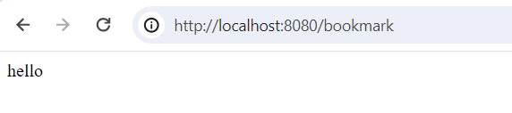

### Quick note on CORS

CORS (Cross Origin Resource Sharing) policy blocks HTTP requests from origins
that are not the same as the one that's serving the requests. Our react app 
(Vite) runs on port 5173, and the express server runs on port 8080. Because they
come from different ports, react app is blocked from making request to the 
express server. While it's annoying, the benefit of CORS is that it allows 
your domain to allow reads from another trusted domain.

A common way to get around this policy is to use `cors` package and let the 
express server know that any requests coming from port 5173 is a good one, and
should be allowed. 

Install it with `npm install cors`, and the above code should work.

### Routing

Now that the Express API is up and running, we're going to set up some routes.
Remember this?
>In API language, this is 1 POST request, and 2 GET requests that we'll have to
implement - one for seeing the latest bookmark, and another to query all 
bookmarks.

Change your server.js to look like this

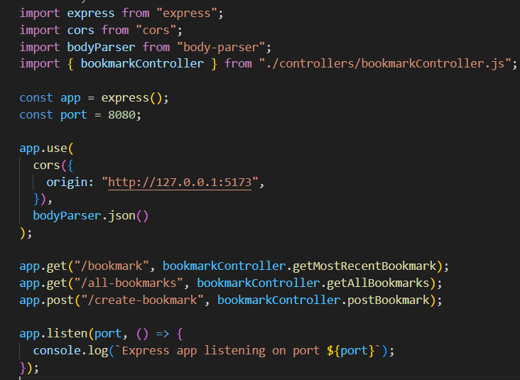

Instead of writing the "bookmark" routing logic function in here, we're going to 
write it in our controller file, and just import it here. Also, we're going to 
add in 2 more routes, `all-bookmarks` GET route, and `create-bookmark` POST route.

Now open up the `controllers/bookmarkControllers.js` and paste in this code

```
// This file contains API Routes
import { pool } from "../model/db.js";

async function getAllBookmarks(req, res) {
  const result = await pool.query("SELECT * FROM bookmarks;");
  res.send(result.rows);
}

async function getMostRecentBookmark(req, res) {
  const result = await pool.query(
    "SELECT * FROM bookmarks WHERE id=(SELECT max(id) FROM bookmarks)"
  );
  res.send(result.rows);
}

async function postBookmark(req, res) {
  // get the bookmark param off request
  const newBookmark = req.body.bookmark;
  const result = await pool.query(
    `INSERT INTO bookmarks(bookmark) VALUES('${newBookmark}');`
  );
  res.send(result);
}

export const bookmarkController = {
  getAllBookmarks: getAllBookmarks,
  getMostRecentBookmark: getMostRecentBookmark,
  postBookmark: postBookmark,
};
```

There's a lot going on here. Let's break it down.
- We first import the database connection pool, so we can make queries.
- We wrote three route functions, and inside each are the corresponding SQL queries.
  - The first 2 get queries are pretty simple
  - But to do the post request, we need to retrieve the bookmark passed in by 
  the user. This lives in the body of the `req` object, and we'll look for the 
  `bookmark` field. (The user should be following this naming convention).
- Then finally, we'll export the three routes as an object.
  
Now if you run `node backend/server.js`, and go to "http://localhost:8080/bookmark",
you should see the bookmark. (My screenshot looks different b/c I added a few more
test cases)

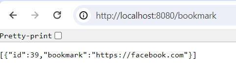

Okidoki, now that we have the DB and the API to interact with it, let's make the
front end. 

## Make React App

Before we get started on React coding, let's add one package.json command. See 
that line 7? This starts up our API server, then starts up the Vite app. This is
how we'll make sure that API server is available when we need to use it from the app.

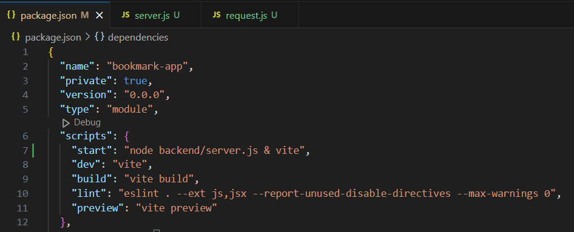

Now we'll work on React + Axios. Although we separated them into two sections,
you have to think about them at the same time as you build your app logic. This
takes trial and error, you'll find that changing one will affect the other.

### Axios

Let's leave it there, and first set up the Axios codes that React will use,
instead of interacting directly with the API server. Open up 
`stores/bookmarkStores.js` and paste the following code.

```
import axios from "axios";

const fetchMostRecentBookmark = (setFunc) => {
  axios.get("http://localhost:8080/bookmark").then((res) => {
    const bookmarkValue = res.data.map((row) => row.bookmark);
    setFunc(bookmarkValue);
  });
};

const fetchAllBookmarks = (setFunc) => {
  axios.get("http://localhost:8080/all-bookmarks").then((res) => {
    const bookmarks = res.data;
    setFunc(bookmarks);
  });
};

// setFunc here sets `mostRecentBookmark`
const createBookmark = (bookmark, setFunc) => {
  axios
    .post("http://localhost:8080/create-bookmark", {
      bookmark: bookmark,
    })
    .then((res) => {
      setFunc(bookmark);
    });
};

export const bookmarkStore = {
  fetchMostRecentBookmark: fetchMostRecentBookmark,
  fetchAllBookmarks: fetchAllBookmarks,
  createBookmark: createBookmark,
};

```
`fetchMostRecentBookmark` makes a GET request to the "/bookmark" route, and 
retrieves the bookmark string from the result (which will be in json). Then, 
using its `setFunc` argument, which will be a useState setter function passed in
from React, we'll set its value to the bookmark string, so that react can use it.

`fetchAllBookmarks` does something very similar with the "all-bookmarks" route, 
but sets the whole JSON object into a state variable.

`createBookmark` is a POST request. It has two arguments, where `bookmark` is the
new bookmark that we want to create, which will be passed into the POST data field,
as a named object, and the similar `setFunc` argument like the GET requests. 
Specifically, we'll set it to be the most recent bookmark. (The most recently 
submitted bookmark IS the most recent bookmark!)

### React

Hopefully you're still with me. Back to React. Let's clear the content of 
src/App.jsx, and replace it with this code. 

```
import { useEffect, useState } from "react";
import "./App.css";
import { bookmarkStore } from "../../backend/stores/bookmarkStore";

function App() {
  const [bookmark, setBookmark] = useState();
  const [mostRecentBookmark, setMostRecentBookmark] = useState();
  const [allBookmarks, setAllBookmarks] = useState();

  // Upon app load, get `mostRecentBookmark` & `allBookmarks` for the first time
  useEffect(() => {
  }, []);

  // Every user keystroke updates `bookmark`
  const handleTextChange = function (event) {
  };

  // Create new bookmark, by sending `createBookmark` POST request
  const handleFormSubmit = function (e) {
  };

  // When mostRecentBookmark is updated via the `createBookmark` POST request,
  // allBookmarks should be updated, by executing the `fetchAllBookmarks` GET request again
  useEffect(() => {
  }, [mostRecentBookmark]);

  return (
    <>
      <h1>My bookmarking app</h1>
      <form onSubmit={handleFormSubmit}>
        <label>
          Enter URL:
          <input type="text" name="url-text" onChange={handleTextChange} />
        </label>
        <input type="submit" value="Submit" />
      </form>

      <h2>Most recently saved bookmark:</h2>
      <span>{mostRecentBookmark}</span>

      <h2>All bookmarks</h2>
      <div id="all-bookmarks">
        <table>
        </table>
      </div>
    </>
  );
}

export default App;
```

Now when you run `npm run start`, you should see a form to enter bookmark, 
a section for displaying the most recent bookmark as text, and a section for 
displaying all bookmarks as a table.

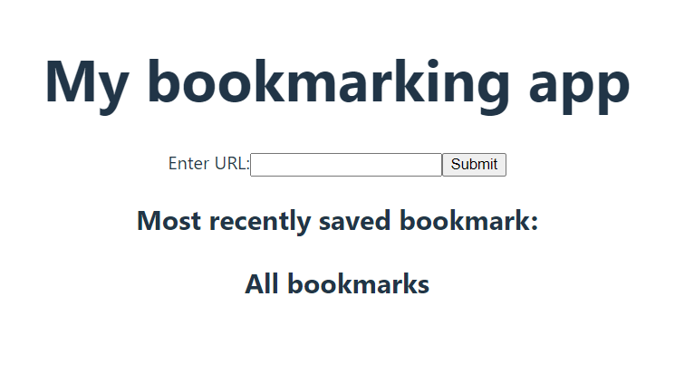

Let's break down the code, and start to add to our app to make it all work, 
starting from the return value.

### Implementation 1

Starting with the easiest one, this section displays the most recent bookmark
as a span. 
```
<h2>Most recently saved bookmark:</h2>
<span>{mostRecentBookmark}</span>
```

We'll interact with the `fetchMostRecentBookmark` Axios code, and pass it the 
`setMostRecentBookmark` setter function for it to update the value. There's two
scenarios where we'll update it; upon load, and whenever a new bookmark is created.

Upon load, we can use the blank [] useEffect to run this code once:
```
useEffect(() => {
  bookmarkStore.fetchMostRecentBookmark(setMostRecentBookmark);
}, []);
```

And upon new bookmark, we'll handle it when we deal with form submission.

### Implementation 2

Let's change this table object
```
<h2>All bookmarks</h2>
<div id="all-bookmarks">
  <table>
  </table>
</div>
```

into this

```
<h2>All bookmarks</h2>
<div id="all-bookmarks">
  <table>
    <thead>
      <tr>
        <th>id</th>
        <th>bookmark</th>
      </tr>
    </thead>
    <tbody>
      {allBookmarks ? (
        allBookmarks.map((row, index) => (
          <tr key={index}>
            <td>{row.id}</td>
            <td>{row.bookmark}</td>
          </tr>
        ))
      ) : (
        <tr>
          <td colSpan="2"></td>
        </tr>
      )}
    </tbody>
  </table>
```

We know that the table has 2 columns, "id" & "bookmark", so we'll hard code the 
`thead` DOM. Now for `tbody`, we'll be referencing the `allBookmarks` state 
variable. When it doesn't exist (AKA, the app hasn't yet received the result of the GET 
request to `fetchAllBookmarks`), we'll just fill in with a blank `td`. But when 
it's available, we'll `map` over the JSON object, to make a `tr` of `td`s, yet 
again, retrieving its id & bookmark field with a hard code.

Similar to `mostRecentBookmark`, `allBookmarks` is updated upon app load, and 
when a new bookmark is created.

We'll change the [] useEffect like so
```
useEffect(() => {
  bookmarkStore.fetchMostRecentBookmark(setMostRecentBookmark);
  bookmarkStore.fetchAllBookmarks(setAllBookmarks);
}, []);
```

And for the new bookmark, we'll listen for change in `mostRecentBookmark` and 
fire off `fetchAllBookmarks` once again.

```
useEffect(() => {
  bookmarkStore.fetchAllBookmarks(setAllBookmarks);
}, [mostRecentBookmark]);
```

### Implementation 3

Finally, the form for the POST request. 


```
<form onSubmit={handleFormSubmit}>
  <label>
    Enter URL:
    <input type="text" name="url-text" onChange={handleTextChange} />
  </label>
  <input type="submit" value="Submit" />
</form>
```

In the input text field, on every key-stroke, we'll save whatever user is typing
to a state variable `bookmark`. This is done through onChange function like so

```
const handleTextChange = function (event) {
  setBookmark(event.target.value);
};
```

And upon form submission, we'll send the `bookmark` value to 
`bookmarkStore.createBookmark` method like so. Notice we're passing in 
`setMostRecentBookmark` setter function to update the most recent bookmark.

```
// Create new bookmark, by sending `createBookmark` POST request
const handleFormSubmit = function (e) {

  // Send the post request, and update `mostRecentBookmark`
  bookmarkStore.createBookmark(bookmark, setMostRecentBookmark);
};
```

There's a bit of clunkiness with how react handles form submission, where it 
refreshes the whole page. So we'll suppress that behaviour, and clear the form 
manually.

```
// Create new bookmark, by sending `createBookmark` POST request
const handleFormSubmit = function (e) {
  // React default behaviour is that on form submit, the entire page refreshes
  // we'll need to suppress it, so the request goes through
  e.preventDefault();

  // Send the post request, and update `mostRecentBookmark`
  bookmarkStore.createBookmark(bookmark, setMostRecentBookmark);

  // Clear form
  e.target.reset();
};
```

Finally, your app code should look like this

```
import { useEffect, useState } from "react";
import "./App.css";
import { bookmarkStore } from "../../backend/stores/bookmarkStore";

function App() {
  const [bookmark, setBookmark] = useState();
  const [mostRecentBookmark, setMostRecentBookmark] = useState();
  const [allBookmarks, setAllBookmarks] = useState();

  // Upon app load, get `mostRecentBookmark` & `allBookmarks` for the first time
  useEffect(() => {
    bookmarkStore.fetchMostRecentBookmark(setMostRecentBookmark);
    bookmarkStore.fetchAllBookmarks(setAllBookmarks);
  }, []);

  // Every user keystroke updates `bookmark`
  const handleTextChange = function (event) {
    setBookmark(event.target.value);
  };

  // Create new bookmark, by sending `createBookmark` POST request
  const handleFormSubmit = function (e) {
    // React default behaviour is that on form submit, the entire page refreshes
    // we'll need to suppress it, so the request goes through
    e.preventDefault();

    // Send the post request, and update `mostRecentBookmark`
    bookmarkStore.createBookmark(bookmark, setMostRecentBookmark);

    // Clear form
    e.target.reset();
  };

  // When mostRecentBookmark is updated via the `createBookmark` POST request,
  // allBookmarks should be updated, by executing the `fetchAllBookmarks` GET request again
  useEffect(() => {
    bookmarkStore.fetchAllBookmarks(setAllBookmarks);
  }, [mostRecentBookmark]);

  return (
    <>
      <h1>My bookmarking app</h1>
      <form onSubmit={handleFormSubmit}>
        <label>
          Enter URL:
          <input type="text" name="url-text" onChange={handleTextChange} />
        </label>
        <input type="submit" value="Submit" />
      </form>

      <h2>Most recently saved bookmark:</h2>
      <span>{mostRecentBookmark}</span>

      <h2>All bookmarks</h2>
      <div id="all-bookmarks">
        <table>
          <thead>
            <tr>
              <th>id</th>
              <th>bookmark</th>
            </tr>
          </thead>
          <tbody>
            {allBookmarks ? (
              allBookmarks.map((row, index) => (
                <tr key={index}>
                  <td>{row.id}</td>
                  <td>{row.bookmark}</td>
                </tr>
              ))
            ) : (
              <tr>
                <td colSpan="2"></td>
              </tr>
            )}
          </tbody>
        </table>
      </div>
    </>
  );
}

export default App;
```

As a last step, we'll make the app a little nicer with a bit of css. Change the 
content of frontend/src/App.css to this:

```
#root {
  max-width: 1280px;
  margin: 0 auto;
  padding: 2rem;
  text-align: center;
}

#all-bookmarks {
  display: flex;
  justify-content: center;
}

#all-bookmarks td,
#all-bookmarks th {
  padding: 8px;
}

#all-bookmarks tr:nth-child(even) {
  background-color: #f2f2f2;
}

#all-bookmarks th {
  padding-top: 12px;
  padding-bottom: 12px;
  text-align: center;
  background-color: #213547;
  color: white;
}

```

Now you should be able to run `npm run start` to have the whole app functioning!


## Conclusion

In this blog post, we looked at how to set up a full-stack Node.js app with 
Postgres db, Express API server, and a React frontend with Axios client, using
Vite local development server.

Here's the [Github repo]("https://github.com/jiwanheo/bookmark-app") of the full thing.

In the next tutorial, we'll be looking at deploying this app on Amazon EC2.
