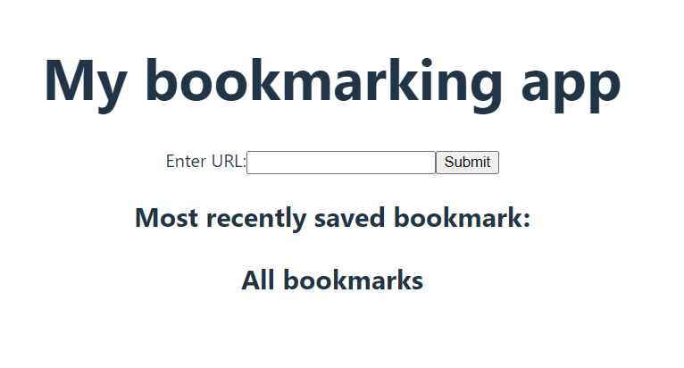
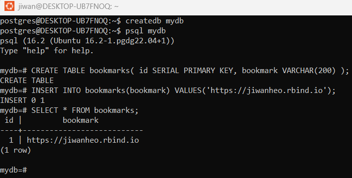

In this post, we'll make a simple bookmark app. Users will be able to save a URL
of a webpage they like, and view it later through this app!

Users will see 3 things in this app

- A form to enter and save URL
- A front page UI for seeing the most recent bookmark
- A table UI for seeing all the bookmarks

So this is 1 POST request, and 2 GET requests - one for seeing the latest 
bookmark, and another to query n number of bookmarks (maybe this can be one, 
with parameter).

## Set up

Let's use vite as our build tool, and start a project called "bookmark-app". Run

`npm create vite@latest bookmark-app`. 

It's going to ask to install package and select
a few options. I'm not going to do anything fancy and go react/javascript.


I'll run the code suggested in the terminal. If you see this screen, you did it 
correctly!


## React app

Let's open this directory in vscode and do some dev'ing. Run `code .`


Let's clear the content of App.jsx, and replace it with this code. 

```
import { useState } from 'react'
import './App.css'

function App() {

  const [bookmark, setBookmark] = useState();

  const handleSubmit = function() {
    alert(`A new url was submitted: ${bookmark}`);
  }

  const handleChange = function(event) {
    setBookmark(event.target.value);
  }

  return (
    <>
      <h1>My bookmarking app</h1>
      <form onSubmit={handleSubmit}>
        <label>Enter URL:
          <input type="text" name="url-text" onChange={handleChange}/>
        </label>
        <input type="submit" value="Submit" />
      </form>
    </>
  )
}

export default App
```

And if you run `npm run dev`, you should see a page with a title, a form to 
submit some text. When submitted, you should get an alert of what the text is.



## API backend

We'll use express.js to build the API server, and Axios to make HTTP requests 
from React to the API.

If you don't have these packages, install them with 
`npm install express` & `npm install axios`

Let's first make a dummy express API and connect it to the app. 
Make a folder called "backend" and create a file called "server.js" in it. 
Then, paste the hello-world example. This is an API that sends "hello world", 
when accessed at the "/api/hello" route out of port 8080.

```
import express from 'express'
const app = express();
const port = 8080

app.get('/hello', (req, res) => {
    res.send("Hello World!")
})

app.listen(port, () => {
    console.log(`Express app listening on port ${port}`)
})
```


Now we need to talk to this API from our react app through axios. Under the src
folder, make a file called "request.js", and paste the following code. This
listens on the same port as the API server, makes a GET Request at the root 
route, then just console logs whatever is returned.

```
import axios from 'axios'

export const apiCall = () => {
    axios.get('http://localhost:8080/hello').then((data) => {
        console.log(data)
    })
}
```

Now that we have the API, and the listener set up, let's set up our react app to 
talk to it. In App.jsx, import in the axios requester function that we just wrote. 


Then we'll write a simple button, that calls the API on click


Now, to get them to both work, we need to run the API server first, then run the
react app. We can do this in `package.json` file, and add a "start" script that
does exactly this. 


Now, when you run `npm run start`, and click on the button to trigger the API 
request, and open devtools ...


You get the cors error.

CORS (Cross Origin Resource Sharing) policy blocks HTTP requests from origins
that are not the same as the one that's serving the requests. Our react app 
(Vite) runs on port 5173, and the express server runs on port 8080. Because they
come from different ports, react app is blocked from making request to the 
express server.

The benefit of CORS is that it allows your domain to allow reads from another 
trusted domain.

But right now, we need a way to get around CORS. A common way to do this is to 
use `cors` package and let the express server know that any requests coming from 
port 5173 is a good one, and should be allowed. 

Let's install in first

`npm install cors`

Then, on our express `server.js`, I added line 2 and 7-11, which tells our API
server that any requests coming in from Vite (port 5173) is safe to process.


Now, if i start the app again, and click the button, you can see in the console 
that "hello world" has been returned.


## Postgres DB

Now that we can take an input from the user, and interact with an API, we're 
going to set up a database. I followed the 
[documentation](https://www.postgresql.org/download/linux/ubuntu/) and ran the 
code they have there on the WSL terminal.

If you're able to run `sudo -i -u postgres` to open a postgres shell, you've 
installed it correctly.


Now, let's create a database. I followed this [tutorial](https://www.postgresql.org/docs/current/tutorial-createdb.html).



I'll go ahead and create a role for this db, and grant all access. Run the 
following code while you're in `mydb`

```
CREATE ROLE mydb_role WITH LOGIN PASSWORD 'some_password';
GRANT ALL PRIVILEGES ON DATABASE "mydb" TO mydb_role;
```


You can log in as mydb_role user by running 

`psql -h localhost -d mydb -U mydb_role`

Which means you'll connect to the localhost server **h**ost, mydb **d**atabase, 
as mydb_role **u**ser


## DB <-> API

Now that we have both the DB and the API working, we're going to actually make 
the bookmarking functionality work. 

### UI Setup

Before we dive into the db, let's quickly build a UI for displaying the most 
recent bookmark saved.

It'll look something like this, where the "Hello World!" will be replaced with
the most recent data in the postgres database.


Let's change the API endpoint name to "bookmark". The implementation of this 
code will change, but for now let's keep it. Also, it has an argument now.
`setFunc` is a setter **function** that will be passed from the app, which will
set the state to the result of the API call.   


Also, change the axios function name to `getMostRecentBookmark`, and have it 
make a GET request to the newly named "bookmark" endpoint.


Then in the react app code, I change the Axios function import, and added a new
state `mostRecentBookmark`, which will be set in Axios `getMostRecentBookmark` 
function. Upon the app load, we'll run this function to get the most recent
bookmark. Finally, we removed the button, and added some texts at the bottom
using `mostRecentBookmark`.


### DB

We need to install `pg`, a PostgreSQL client for Node.js.

`npm install pg`

Now under the backend folder, create a file called "db.js", where we'll handle 
the db connection. Then paste in this code. We'll import the Pool class, which
allows multi-user access to the db. Then, we create an instance of it with out
login creds. (This should be done with environment variables, please don't hard
code in real life applications!) 


We now determine what to return. We'll return an object with two items inside,
the pool object, and a function. `process.postgresql = connection;` assigns the
connection to a global variable, so it can be accessed anywhere in the app.

Focusing on the function part, where we handle the connection, execution of 
the query, and releasing the pool. After these three operations, we finally 
return the `rows` value, which is the query result.


Great! we have a db connection that we can use in our app. But our database is 
empty right now, and we haven't written a POST API method to write data to it.
So let's insert some data in the DB.


