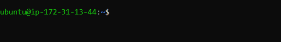

Hello! This is a continuation of my series of making a fullstack Node app. In the
last [post](https://jiwanheo.rbind.io/fullstack-app-part-1/), we made a 
functioning Node app, that saves and retrieves bookmarks. In this post, we'll 
be deploying this app to the AWS EC2 cloud, so people can access it from the 
internet.

## AWS EC2 Setup

Head over to [AWS](https://aws.amazon.com/), you'll need to create an account 
if you don't have one.

Search for EC2, and click on it to open the management console.


Now, click "Launch instance".


By launching an instance, we're setting up a virtual machine, where we'll repeat 
what we did on our local laptops, like installing node, postgres, ... and be able
to access it over the internet.

Let's name it "Bookmark App", and select Ubuntu as our base image (like the 
one that we're using in WSL). We'll leave the architecture to 64-bit (x86).


And on "instance type", leave it as "t2.micro", which should be on the free-tier, 
if you're doing it for the first time.


On to the key-pair (login). We're going to be accessing this VM from our laptops
over the internet through SSH. So we need to create a key pair. Click on "Create
new key pair". Give it some name, and hit "Create key pair"


It will download a file to your Downloads folder. We'll be using this later, so
don't delete it!


Now moving down to the "Network settings", we'll allow SSH from My IP only, just 
to be a little safer, and allow HTTPS/HTTP traffic from the internet, because 
we want people to be able to access it.


We'll leave everything else alone, and hit "Launch instance" to set up our 
virtual machine.


## Connect to VM

The very next thing we'll do is to connect to the create instance. Hit "Connect
to instance".


We'll connect via SSH client.


But first, open the WSL terminal and move the keypair.pem file from windows to 
the WSL file system.

```
sudo mv /mnt/c/Users/jiwan/Downloads/jiwan-keypair.pem ~/.ssh/jiwan-keypair.pem
```

Now cd into the `~/.ssh` directory, and run the example code provided in the 
above screenshot. 

```
chmod 400 "jiwan-keypair.pem"

# here, you might have to specify the full path "~/.ssh/jiwan-keypair.pem" 
ssh -i "jiwan-keypair.pem" ubuntu@ec2-18-117-170-169.us-east-2.compute.amazonaws.com
```
Annnnnd, we're in. You can see the terminal changed to Ubuntu at the IP address 
of the VM. Anything I run in this terminal, isn't running on my laptop anymore, 
instead it'll run on the AWS VM. How cool!



## Setup VM to run Node app

The first thing you'll have to do is to run apt update/upgrade

```
sudo apt update && sudo apt upgrade
```

Then it'll take you to this weird screen.


Hit enter, and it'll ask you which services should be restarted. I'm just going 
to restart everything, by selecting with spacebar, and hitting enter, to confirm.
It just means it'll use the most updated versions of those packages.


### Install node & postgres

Now, we'll install node & postgres like we did with out laptop in Part 0 of this 
series.

For node:

```
curl -o- https://raw.githubusercontent.com/nvm-sh/nvm/v0.39.7/install.sh | bash
```

Restart the terminal (you'll have to SSH back in), then run 

```
nvm install node
```

Now postgres, we did this in Part 1 blog post. I'm kinda regretting not doing 
everything in a script, because now I need to run the exact same commands in 
terminal.

Install postgresql
```
sudo sh -c 'echo "deb https://apt.postgresql.org/pub/repos/apt $(lsb_release -cs)-pgdg main" > /etc/apt/sources.list.d/pgdg.list'

wget --quiet -O - https://www.postgresql.org/media/keys/ACCC4CF8.asc | sudo apt-key add -

sudo apt-get update

sudo apt-get -y install postgresql
```

Log in as postgres user

```
sudo -i -u postgres
```

Create DB and table

```
createdb mydb
psql mydb

CREATE TABLE bookmarks( id SERIAL PRIMARY KEY, bookmark VARCHAR(200) );
INSERT INTO bookmarks(bookmark) VALUES ('https://jiwanheo.rbind.io');
```

Create role

```
CREATE ROLE mydb_role WITH LOGIN PASSWORD 'some_password';
GRANT SELECT, UPDATE, INSERT ON bookmarks TO mydb_role;
GRANT USAGE, SELECT ON ALL SEQUENCES IN SCHEMA public TO mydb_role;
```

Ok, that should be good, you can quit the postgres shell.

From the VM shell, we'll run two more commands to make sure postgres is always
running, even when we restart the VM instance. Run

```
sudo systemctl start postgresql
sudo systemctl enable postgresql
```


### Expose localhost

There's just one more thing that we have to do, and that's exposing the localhost
to the local network. So far, all we've been doing runs on localhost. Meaning, if 
someone else wanted to access whatever's running (AKA me, over the internet into
whatever's running on VM), we wouldn't be able to, because from outside, we don't
know what localhost is.

We can get around this by using `--host` option to our `vite` call, when we launch
the app via `npm run start`. Open the package.json file, and add the `--host` flag


### Copy app code to VM

Now, I want to put the React app code into this virtual machine, so I can run it 
from there.

We *can* use scp command to do this, but we'll use
[`rsync`](https://linux.die.net/man/1/rsync). They're basically the same thing, 
but rsync provides more options in different scenarios, like if some files are 
already transferred, it will only send the new files, and many more.

```
rsync --progress -avz --exclude 'node_modules' --exclude '.git' --exclude '.env' \ 
-e "ssh -i ~/.ssh/jiwan-keypair.pem" \
. ubuntu@ec2-18-117-170-169.us-east-2.compute.amazonaws.com:~/bookmark-app
```

This command sends everything in the current directory (. in the last line) to
the ubuntu address in "bookmark-app" directory, using the keypair.pem file, excluding node_modules, .git,
and .env files.

Please edit the keypair file name, and the Ubuntu address to whatever you have, 
and run this from your laptop's WSL terminal in the bookmark-app directory, 
not the VM.


You should see a long command line messages, but it'll say "created directory ...".

Now SSH into the VM, and run `ls` to see everything is there. If it tells you 
system reboot is required, run `sudo reboot`


Now, just like any other new project, we'll start with an `npm install` command.


At this point, we're good to launch the app with `npm run start`, but we have to
do one more thing to see if the app is working. And that's the security setting.
Head over to the security section, and click on the security group.


What you see here is basically a firewall, that controlls how people can access
the application. We see that inbound traffic over port 22 (ssh), 80 (HTTP), 443 
(HTTPS) are allowed, because that's how we initialized it. This is desirable, 
because we want people to come in here only through those ports. But our Vite 
app runs on port 5173. We don't want people accessing over this port, but for 
our development purposes, let's quickly allow this to see if it works, and take 
it right off.

Click on "Edit inbound rules"


Click "Add rule", and add 5173 as port, with only My IP as source, and hit save.


Ok, now, let's get the public IP address for this VM, which can be found on the
"instances" sidebar tab, and "Public IPv4" column.


Now, if I go to chrome, and type `http://18.191.178.151:5173`, we're able to see the 
app! (Your address will be different) 


It's great we can get the app to work, but it's not done yet. Notice how the database
fetch didn't work, and we don't see any bookmarks. This is because of that localhost 
thing.
