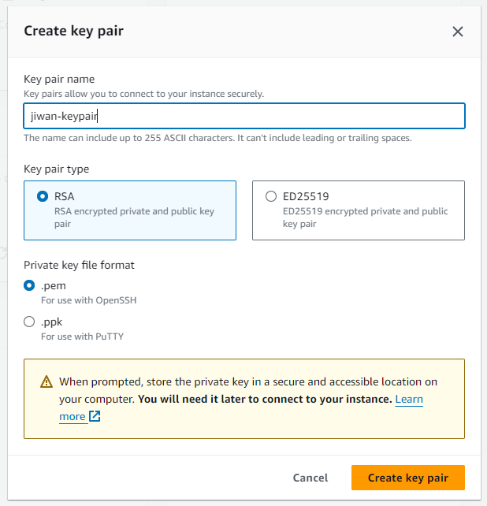
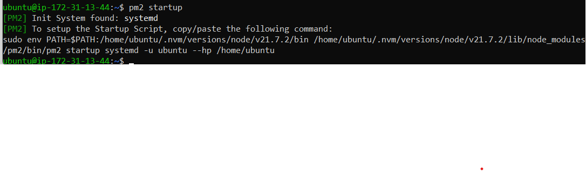

Hello! This is a continuation of my series of making a fullstack Node app. In the
[last post](https://jiwanheo.rbind.io/fullstack-app-part-1/), we made a 
functioning Node app that saves and retrieves bookmarks. In this post, we'll 
be deploying this app to the AWS EC2 cloud, so people can access it from the 
internet.

A quick heads-up, the IP address of my VM will be inconsistent between screenshots
because I rebooted the instance quite a bit while writing this blog, but it's not 
an important detail, so nothing to worry about!

## AWS EC2 Setup

Head over to [AWS](https://aws.amazon.com/), you'll need to create an account 
if you don't have one.

Search for EC2, and click on it to open the management console.


Now, click "Launch instance".


By launching an instance, we're setting up a virtual machine, where we'll repeat 
what we did on our local laptops, like installing node, postgres, ... and be able
to access it over the internet.

Let's name it "Bookmark App", and select Ubuntu as our base image (like the 
one that we're using in WSL). We'll leave the architecture to 64-bit (x86).


And on "instance type", leave it as "t2.micro", which should be on the free-tier, 
if you're doing it for the first time.


On to the key-pair (login). We're going to be accessing this VM from our laptops
over the internet through SSH. So we need to create a key pair. Click on "Create
new key pair". Give it some name, and hit "Create key pair"



It will download a file to your Downloads folder. We'll be using this later, so
don't delete it!


Now moving down to the "Network settings", we'll allow SSH from My IP only, just 
to be a little safer, and allow HTTPS/HTTP traffic from the internet, because 
we want people to be able to access it.


We'll leave everything else alone, and hit "Launch instance" to set up our 
virtual machine.


## Connect to VM

The very next thing we'll do is to connect to the created instance. Hit "Connect
to instance".


We'll connect via SSH client.


But first, open the WSL terminal and move the keypair.pem file from windows to 
the WSL file system's `~/.ssh` directory.

```
sudo mv /mnt/c/Users/jiwan/Downloads/jiwan-keypair.pem ~/.ssh/jiwan-keypair.pem
```

Now cd into the `~/.ssh` directory, and run the example code provided in the 
above screenshot. 

```
chmod 400 "jiwan-keypair.pem"

# here, you might have to specify the full path "~/.ssh/jiwan-keypair.pem" 
ssh -i "jiwan-keypair.pem" ubuntu@ec2-18-117-170-169.us-east-2.compute.amazonaws.com
```
Annnnnd, we're in. You can see the terminal changed to Ubuntu at the IP address 
of the VM. Anything I run in this terminal, isn't running on my laptop anymore, 
instead it'll run on the AWS VM.


## Setup VM to run Node app

The first thing you'll have to do is to run apt update/upgrade

```
sudo apt update && sudo apt upgrade
```

Then it'll take you to this weird screen.


Hit enter, and it'll ask you which services should be restarted. I'm just going 
to restart everything, by selecting with spacebar, and hitting enter, to confirm.
It just means it'll use the most updated versions of those packages.


### Install node & postgres

Now, we'll install node & postgres like we did with our laptop in Part 0 of this 
series.

For node:

```
curl -o- https://raw.githubusercontent.com/nvm-sh/nvm/v0.39.7/install.sh | bash
```

Restart the terminal (you'll have to SSH back in), then run 

```
nvm install node
```

Now postgres, we did this in Part 1 blog post. I'll do it manually for now.

Install postgresql
```
sudo sh -c 'echo "deb https://apt.postgresql.org/pub/repos/apt $(lsb_release -cs)-pgdg main" > /etc/apt/sources.list.d/pgdg.list'

wget --quiet -O - https://www.postgresql.org/media/keys/ACCC4CF8.asc | sudo apt-key add -

sudo apt-get update

sudo apt-get -y install postgresql
```

Log in as postgres user

```
sudo -i -u postgres
```

Create DB and table

```
createdb mydb
psql mydb

CREATE TABLE bookmarks( id SERIAL PRIMARY KEY, bookmark VARCHAR(200) );
INSERT INTO bookmarks(bookmark) VALUES ('https://jiwanheo.rbind.io');
```

Create role

```
CREATE ROLE mydb_role WITH LOGIN PASSWORD 'some_password';
GRANT SELECT, UPDATE, INSERT ON bookmarks TO mydb_role;
GRANT USAGE, SELECT ON ALL SEQUENCES IN SCHEMA public TO mydb_role;
```

Ok, that should be good, you can quit the postgres shell.

From the VM shell, we'll run two more commands to make sure postgres is always
running, even when we restart the VM instance. Run

```
sudo systemctl start postgresql
sudo systemctl enable postgresql
```


### Expose localhost

There's just one more thing that we have to do, and that's exposing the localhost
to the local network. So far, all we've been doing runs on localhost. Meaning, if 
someone else wanted to access whatever's running (AKA me, over the internet), 
we wouldn't be able to, because from outside, localhost just means their laptop.

We can get around this by using `--host` option to our `vite` call, when we launch
the app via `npm run start`. Open the package.json file, and add the `--host` flag.
Once done, push this up in a git repository.

This is just temporary, to see everything works. Further into this post, we'll
be using nginx to serve everything.


### Git clone code to VM

Now SSH into the VM, and git clone the repo down.

Now, just like any other new project, we'll start with an `npm install` command.


To see if the app is working, let's head over to the security section, 
and click on the security group.


What you see here is basically a firewall, that controlls how people can access
the application. We see that inbound traffic over port 22 (ssh), 80 (HTTP), 443 
(HTTPS) are allowed, because that's how we initialized it. This is desirable, 
because we want people to come in here only through those ports. But our Vite 
app runs on port 5173. We don't want people accessing over this port, but for 
our development purposes, let's quickly allow this to see if it works, and take 
it right off.

Click on "Edit inbound rules"


Click "Add rule", and add 5173 as port, with only My IP as source, and hit save.


Ok, now, let's get the public IP address for this VM, which can be found on the
"instances" sidebar tab, and "Public IPv4" column.


Now, if I go to chrome, and type `http://18.191.178.151:5173`, we're able to see the 
app! (Your address will be different) 


It's great we can get the app to work, but it's not done yet. Notice how the database
fetch didn't work, and we don't see any bookmarks. This is because our react app
is not able to communicate to the API server over localhost. 
That's enough to see if the app is functioning on EC2. We'll stop here, and
start serving up our API server and the react app more properly.

## PM2 

pm2 is a process manager. We'll use pm2 to manage (start/restart) the API server, 
instead of running it in the terminal ourselves. Run

```
npm install pm2 -g
```

Let's point pm2 to the location of our server.js file (using the name flag to
name it)

```
pm2 start ~/bookmark-app/backend/server.js --name bookmark-app
```


We'll configure pm2 to automatically startup the process after a reboot. Running
this command will give you some command to run. 

```
pm2 startup
```



Run it.

After it runs, we can check if it's running with

```
pm2 status
```


Save the current list of processes so that the same processes are started during 
bootup.


We can see that the API server is working by running.

```
curl localhost:8080/bookmark
```


## Nginx

Nginx is a web server that can also be used as a web server, or a reverse proxy.
We'll be using it as a web server that serves our static app file (dist/index.html), 
and a reverse proxy that points to our API server.

Go to `frontend` folder, and run `npm run build`. This will create a finalized
version of the app `index.html` at `dist` folder. Anytime you make a change to 
the app, you'll have to re-build it.

Install nginx

```
sudo apt install nginx -y
sudo systemctl enable nginx
```

Each site that uses nginx needs a config block setup. The config file lives in
`/etc/nginx/sites-available`. We'll just be editing the default setting.

```
cd /etc/nginx/sites-available
```

This file is linked to /etc/nginx/sites-enabled, which nginx uses to 
construct the /etc/nginx/nginx.conf file.

### Front end server

Open the default file with Nano. Once in it, hit `alt + n` to show line numbers.

```
sudo nano default
```

And change it to look like this. I only changed line 41, but I'll explain what
the file is doing.


Line 22-23: Tells nginx to listen for trafic on port 80 (http)

Line 41: Tells nginx the path of the index.html file to serve (our react app)

Line 44: Tells nginx which files to serve

Line 46: We can define a server name, which we skipped

Line 48-52: Redirects all traffic to any path other than `/` to `/`.


Now, enable the new site by restarting it.

```
systemctl restart nginx
```

Now if you go to the public IP address, you should see the frontend app! (without
the API server interaction)


### Prod vs Dev API base path

Before we set up the API server communication, remember that we hardcoded API 
requests to come from "localhost" like this?


This works fine on development environment, because both the react app and the 
API server runs on the same machine, therefore the localhost is the same thing.
But in production, we're serving them both from cloud. And the localhost is the 
loopback address, meaning it points to the user's machine, which obviously
doesn't have neither our app nor the API server.

To get around this, we'll use environment variables to point to two different 
locations depending on whether we're viewing the app from development or prod
environments.

In Node, we get an environment variable called "NODE_ENV" for free. Depending on 
how we're running node, we'll get different values here (npm run build will 
assign "production", npm run dev will assign "development").

In places where we hardcoded the API base ("localhost"), we're now going to 
conditionally define it with an ifelse based on the "NODE_ENV" variable value.


Run `npm run start` to see if the app is running locally. I had to change 
"127.0.0.1" to "localhost" (per [this commit](https://github.com/jiwanheo/bookmark-app/commit/ab23f160fed3a495fa6e26629e96160d253314cf)), 
but you might not have to.


Now head over to EC2, pull the commit down. We'll do one more config before 
everything works.

### API server

Nginx will proxy our API requests, by sending our request (initiated from the 
react app code), to the API server that pm2 is running locally at port 8080, 
and returning the response back to us. 

To do this, we need to add another `location`
block to our nginx config file. Open up the `etc/nginx/sites-available/default`
file again.

We added line 54-60, which tells nginx to redirect the `/api/` (the apiBase that
we set for prod environments), to localhost port 8080, and we're setting a 
bunch of information in the request header, to let the API server know where the 
request came from.


Save this, and restart nginx by running `sudo systemctl restart nginx`.

After this, you should be able to see the app working!


Success! 

Now, we don't have too much left! We'll just set up DNS, so we have an easy domain
name, instead of IPv4 address, and then we'll set up SSL security. 

## DNS

Domain name service maps English names like "google.com" to IP address like
"192.178.52.174". 

To do this, first, we'll need to buy a domain name. I'll head over to 
[namecheap.com](https://www.namecheap.com/), and do a search for "jiwanheo". 
"jiwanheo.xyz" is pretty cheap, so I'll buy that.


Once you're done with the purchase, come into the management page, and look for
the "nameserver" section. We'll be setting up a custom DNS, through AWS route 53 
service. This means anytime someone visits jiwanheo.xyz, where they end up will 
be determined by what we set up on AWS.


Before we do that, we need to create the hosted zone in AWS. Head over to AWS, 
and search route 53.


On "get started" page, click "Create hosted zone".


Then fill it with your domain name, and click "Create hosted zone".


Now, you're gonna be able to see the ns record.


We're going to copy these into namecheap.


Click the checkmark, and you're done! We've purchased a domain name, and 
connected it to the hosted zone on AWS. This change will take some time to 
fully process. We'll still go ahead and set up the record to point to our app, but
you'll probably have to wait a little to see it take effect.

Go back to your EC2 instance, and grab the IP address.


Then, come back to route 53, and click "create record"


Then switch the the wizard view


And we'll go with simple routing.


Click "define simple record".


Then we'll name our record. I chose "bookmark-app". Record type should be "A",
we'll route traffic to an IP address, and paste in the IP address to our instance.


Then, hit "Define simple record" and "Create records".

That's it! This should take about 30 minutes to go through.

## SSL/HTTPS

The last thing we'll do is setup the SSL certificate, so we can use HTTPS. We'll
be using letsencrypt, via certbot. I'll be following 
[this tutorial](https://www.digitalocean.com/community/tutorials/how-to-secure-nginx-with-let-s-encrypt-on-ubuntu-22-04).

Before we do this, we kinda have to fix a lazy thing I did.

Certbot will be using the server block in `/etc/nginx/sites-available/`, and will
be looking for "server_name" directive. We kinda did everything on the default
config, and didn't set up a "server_name". Just to make it really obvious, we'll 
copy the default file into a file on its own, name it "bookmark-app", link it 
to `/etc/nginx/sites-enabled/` and delete the default file.


In bookmark-app file, we added the server_name at line 46.


And we'll link it to the sites-enabled by running this

```
sudo ln -s /etc/nginx/sites-available/bookmark-app /etc/nginx/sites-enabled/
```

Now delete the default file in both sites-available and sites-enabled dirs.

```
sudo rm default
cd ../sites-enabled
sudo rm default
```

Now if we restart nginx with `sudo systemctl restart nginx`, the website should still
be running. Ok, now that we got that figured out, let's jump back to installing 
certbot.

Install `snap`
```
sudo snap install core; sudo snap refresh core
```

Install `certbot`

```
sudo snap install --classic certbot
```

Link certbot from snap to our environment.

```
sudo ln -s /snap/bin/certbot /usr/bin/certbot
```

Because we set up the `server_name` directive in the config file, certbot should
be able to find the correct server block and update it automatically. 

We'll skip the `ufw` step, because we're doing the firewall stuff on EC2. Just make
sure that in security group, you're allowing HTTP/HTTPS access from anywhere.

Now, we have to obtain an SSL certificate. Run

```
sudo certbot --nginx -d bookmark-app.jiwanheo.xyz
```

It'll ask for your email, and say yes to a few things. (If you're trying this 
right after you set up the DNS, it'll likely fail, because it's still being set up)

After this is done, Nginx configuration will now automatically redirect all web 
requests to https. Visit http://bookmark-app.jiwanheo.xyz (your equivalent), and
you should see that it's redirected to https!


The last thing we'll do is to automate the renewal process. Run

```
sudo certbot renew --dry-run
```

And that's pretty much it! We successfully set up the SSL certificate on our web application!

## Conclusion

In this post, we set up Amazon EC2 VM instance to be able to access the app over 
the internet. 

We configured the VM to run a Node app and a postgres db. We cloned down the git 
repo of our project, and set up the Express API server to run as a process via PM2. 
We used nginx to serve the static version the react app, configured reverse-proxy 
so that API requests from the app over port 80 is redirected to the Express API 
server running on port 8080.

After this, we configured DNS, so that instead of using IPv4 address, the app could
be accessed with a sensible English name, and finally set up SSL certificate so that
the app can use secure communication.

In the next post, we'll be looking to make the deployment process easier, by
containerizing our app with Docker.
